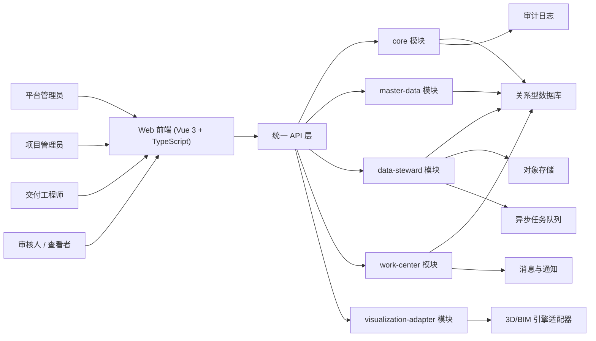
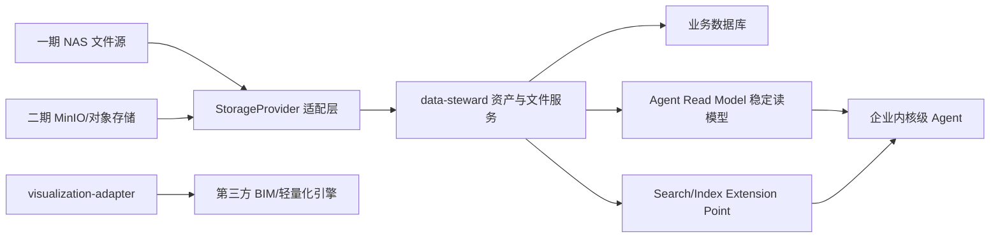
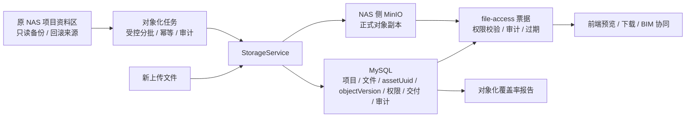
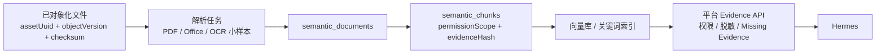
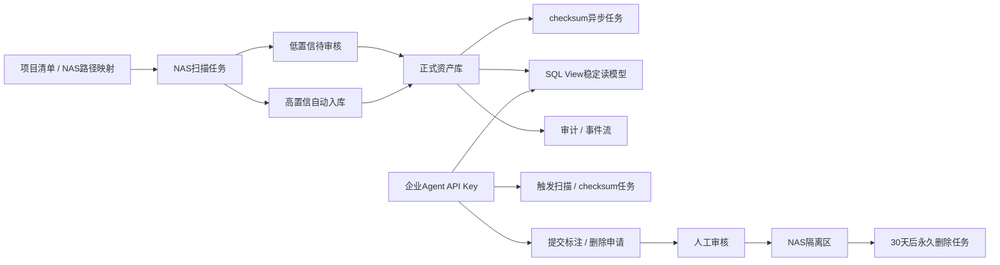
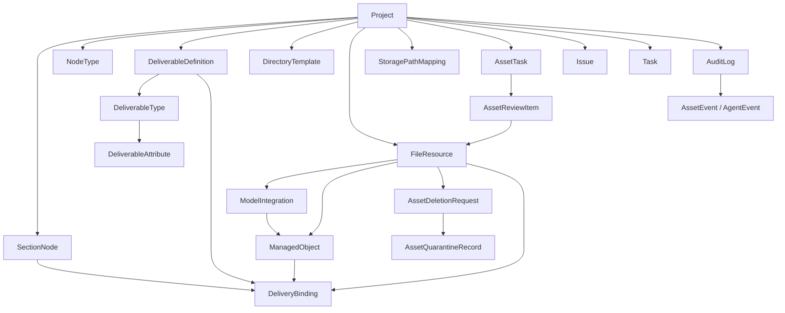

# 卓羽智能数据中台总体架构与系统设计

## 1. 设计原则

- 标准优先：先定义部位、节点、交付物和属性，再开放下游资源与视图。
- 模块清晰：按业务域组织为模块化单体，保持独立边界和独立 REST 接口。
- 资源抽象：文件、模型、管理对象、交付绑定分层建模，避免业务直接依赖物理文件。
- 存储抽象：文件物理位置必须通过 `StorageProvider` 适配，业务层只依赖稳定资源标识。
- Agent 友好：企业 agent 通过稳定读模型或 API 检索资产，不直接耦合易变业务底表。
- 后端数据治理优先：一期先稳定数据库、任务、审核、审计、读模型和 OpenAPI，前端资产页面后置。
- 高风险操作受控：NAS 原文件物理删除必须申请、审核、隔离和审计，不允许直接永久删除。
- 三维可插拔：3D 引擎通过适配层接入，不让上层业务依赖具体厂商页面。
- 私有化友好：默认支持内网部署、细粒度权限、审计追踪和对象存储接入。

## 2. 总体架构



### 2.1 三期架构增量



一期先实现 `NAS + 元数据入库 + 待审核队列 + SQL View + 事件流`。当前 M3 已把对象存储主链路推进到 `NAS 侧 MinIO + MySQL 台账 + active object version + 受控 file-access`。搜索索引、语义证据层和构件级 BIM 能力仍在后续 M4/M5/8D/8E。

### 2.3 当前 M3 对象存储架构基线



当前约束：

- 105 项目已完成全量对象化，非 105 项目仍按覆盖率报告分批推进。
- `data_file_resources` 继续作为业务资产台账，不被对象存储表取代。
- 对外稳定资产标识优先使用 `assetUuid`，数值 `fileId` 主要用于内部排障和接口兼容。
- 前端和普通 API 不返回真实 NAS 路径、bucket、object key、`storage_uri`。
- 对象存储完成只代表文件本体治理完成，不代表正文语义理解完成。

### 2.4 后续语义证据与 Hermes 架构目标



后续约束：

- Hermes 不直连 MySQL、NAS、MinIO、Qdrant 或 OpenSearch。
- Hermes 只能通过平台 Evidence API 获取脱敏证据。
- 没有正文证据时必须返回 Missing Evidence，不能把 catalog-only 元数据伪装成正文理解。
- DWG / RVT / IFC 深度解析和 BIM 构件级能力后置，不阻塞 M4 小样本证据层。

### 2.2 一期后端数据治理链路



## 3. 逻辑模块划分

## 3.1 `core`

职责：

- 租户、组织、用户、项目
- 角色与权限
- 消息中心
- 审计日志
- 字典、模板、系统配置

建议包结构：

- `core.project`
- `core.org`
- `core.auth`
- `core.message`
- `core.audit`
- `core.config`

## 3.2 `master-data`

职责：

- 工程管理部位树
- 节点类型配置与锁定
- 交付物定义
- 交付物类型
- 交付物属性
- 目录模板
- 关联模型

建议包结构：

- `masterdata.section`
- `masterdata.node`
- `masterdata.deliverable`
- `masterdata.template`
- `masterdata.binding`

## 3.3 `data-steward`

职责：

- 项目资产台账
- 文件资源
- 图纸/文档分类
- 模型文件
- 模型集成
- 管理对象
- 文件服务
- NAS 扫描、批量导入、容量统计
- 待审核队列、人工标注、项目归属修正
- checksum 异步补齐
- 任务状态、失败原因、重试
- `StorageProvider` 存储适配
- 企业 agent SQL View 稳定读模型
- agent API Key、项目范围授权、变更申请
- 审计/事件流增量同步
- 隔离删除、恢复和永久删除任务
- 导入导出

建议包结构：

- `datasteward.asset`
- `datasteward.asset.review`
- `datasteward.resource`
- `datasteward.model`
- `datasteward.integration`
- `datasteward.object`
- `datasteward.service`
- `datasteward.storage`
- `datasteward.agentread`
- `datasteward.agentauth`
- `datasteward.task`
- `datasteward.event`
- `datasteward.deletion`

## 3.4 `work-center`

职责：

- 项目首页
- 文档交付管理/视图
- 图纸交付管理/视图
- 事项、任务
- 文件看板
- 大屏数据聚合

建议包结构：

- `workcenter.home`
- `workcenter.delivery.document`
- `workcenter.delivery.drawing`
- `workcenter.issue`
- `workcenter.task`
- `workcenter.dashboard`

## 3.5 `visualization-adapter`

职责：

- 对接 3D/BIM 引擎
- 发布模型
- 构件定位
- 构件高亮
- 图模联动
- 项目/部位/对象上下文注入
- 模型轻量化任务接入
- 构件属性、构件搜索、移动端预览接口预留

建议包结构：

- `visualization.adapter`
- `visualization.publish`
- `visualization.query`

## 4. 核心实体设计

## 4.1 实体清单

- `Project`
- `SectionNode`
- `NodeType`
- `DeliverableDefinition`
- `DeliverableType`
- `DeliverableAttribute`
- `DirectoryTemplate`
- `FileResource`
- `ModelIntegration`
- `ManagedObject`
- `DeliveryBinding`
- `StorageRoot`
- `StoragePathMapping`
- `AssetImportJob`
- `AssetScanTask`
- `AssetReviewItem`
- `AssetTask`
- `AgentApiKey`
- `AgentChangeRequest`
- `AssetDeletionRequest`
- `AssetQuarantineRecord`
- `AgentReadModel`
- `AssetEvent`
- `Issue`
- `Task`
- `AuditLog`

## 4.2 关键关系



## 4.3 实体字段建议

### `Project`

- `id`
- `code`
- `name`
- `industryType`
- `ownerOrgName`
- `designOrgName`
- `constructOrgName`
- `supervisionOrgName`
- `status`
- `createdAt`
- `updatedAt`

### `SectionNode`

- `id`
- `projectId`
- `parentId`
- `code`
- `name`
- `level`
- `path`
- `sortOrder`
- `status`

### `NodeType`

- `id`
- `projectId`
- `code`
- `name`
- `scopeLevel`
- `locked`
- `lockedAt`
- `lockedBy`

### `DeliverableDefinition`

- `id`
- `projectId`
- `nodeTypeId`
- `code`
- `name`
- `category`
- `required`
- `status`

### `DeliverableType`

- `id`
- `projectId`
- `deliverableDefinitionId`
- `code`
- `name`
- `fileKind`
- `bindingStrategy`

### `DeliverableAttribute`

- `id`
- `projectId`
- `deliverableTypeId`
- `code`
- `name`
- `valueType`
- `unit`
- `required`
- `exampleValue`
- `enumOptions`

### `DirectoryTemplate`

- `id`
- `projectId`
- `templateType`
- `name`
- `rootNodeJson`
- `sourceType`

### `FileResource`

- `id`
- `projectId`
- `resourceType`
- `fileName`
- `fileExt`
- `sizeBytes`
- `storageKey`
- `storageProvider`
- `storagePath`
- `logicalPath`
- `checksum`
- `discipline`
- `sourceType`
- `versionNo`
- `processStatus`
- `processDurationMs`
- `confidenceStatus`
- `reviewStatus`
- `lastVerifiedAt`
- `sourcePathDigest`
- `createdBy`
- `createdAt`

### `StoragePathMapping`

- `id`
- `projectId`
- `providerCode`
- `rootCode`
- `nasPath`
- `matchStrategy`
- `status`
- `createdBy`
- `createdAt`

### `StorageRoot`

- `id`
- `providerCode`
- `rootCode`
- `displayName`
- `rootPath`
- `accessMode`
- `status`

### `AssetImportJob`

- `id`
- `jobType`
- `sourceName`
- `status`
- `totalCount`
- `successCount`
- `failureCount`
- `reportJson`
- `createdBy`
- `createdAt`

### `AssetReviewItem`

- `id`
- `scanTaskId`
- `candidatePath`
- `fileName`
- `fileExt`
- `sizeBytes`
- `mtime`
- `suggestedProjectId`
- `suggestedFileKind`
- `confidenceLevel`
- `reviewStatus`
- `reviewedBy`
- `reviewedAt`
- `reviewComment`

### `AssetTask`

- `id`
- `taskType`
- `status`
- `progress`
- `retryCount`
- `failureReason`
- `createdBy`
- `createdAt`
- `updatedAt`

### `AgentApiKey`

- `id`
- `agentCode`
- `keyHash`
- `projectScope`
- `status`
- `expiresAt`
- `lastUsedAt`

### `AssetDeletionRequest`

- `id`
- `fileResourceId`
- `requesterType`
- `requestedBy`
- `reason`
- `approvalStatus`
- `approvedBy`
- `approvedAt`
- `executionStatus`

### `AssetQuarantineRecord`

- `id`
- `deletionRequestId`
- `fileResourceId`
- `originalPath`
- `quarantinePath`
- `quarantinedAt`
- `retentionUntil`
- `restoreStatus`
- `permanentDeleteStatus`

### `AgentReadModel`

`AgentReadModel` 一期优先采用 MySQL SQL View。后续如有性能或同步需求，可演进为物化表或同步表，但字段含义必须保持稳定。固定输出：

- `ProjectAssetView`
- `FileAssetView`
- `ModelAssetView`
- `AuditEventView`

### `ModelIntegration`

- `id`
- `projectId`
- `name`
- `sourceResourceIds`
- `publishStatus`
- `publishVersion`
- `engineModelId`
- `processedAt`

### `ManagedObject`

- `id`
- `projectId`
- `name`
- `objectType`
- `sourceType`
- `sourceId`
- `status`

### `DeliveryBinding`

- `id`
- `projectId`
- `sectionNodeId`
- `deliverableDefinitionId`
- `deliverableTypeId`
- `managedObjectId`
- `fileResourceId`
- `bindingStatus`
- `viewKind`

### `Issue`

- `id`
- `projectId`
- `title`
- `issueType`
- `status`
- `assigneeId`
- `relatedObjectId`

### `Task`

- `id`
- `projectId`
- `title`
- `taskType`
- `status`
- `dueAt`
- `assigneeId`

### `AuditLog`

- `id`
- `projectId`
- `moduleCode`
- `actionCode`
- `targetType`
- `targetId`
- `operatorId`
- `beforeSnapshot`
- `afterSnapshot`
- `createdAt`

## 5. 关键状态机

## 5.1 节点类型状态

`draft -> locked`

约束：

- 一旦锁定，不允许静默修改影响下游结构的关键字段。
- 如需变更，必须走显式解锁或新版本机制。

## 5.2 文件资源状态

`uploaded -> processing -> processed / failed`

## 5.3 模型集成状态

`created -> integrating -> integrated -> published / failed`

## 5.4 交付绑定状态

`unbound -> partially_bound -> bound -> verified`

## 5.5 资产导入与 NAS 扫描状态

`pending -> running -> success / failed / cancelled`

约束：

- 扫描任务必须可查询状态、失败原因和重跑结果。
- 文件登记成功不代表模型轻量化成功，二者状态必须分离。

## 5.6 模型轻量化状态

`not_required -> queued -> converting -> preview_ready / failed`

一期默认 `not_required`，二期由 `visualization-adapter` 或第三方 BIM 引擎适配器更新。

## 6. REST 契约

以下契约按域稳定输出，供后续开发 agent 直接实现。

## 6.1 `core` 域

### 项目初始化

- `POST /api/core/projects`
- `GET /api/core/projects/{projectId}`
- `PATCH /api/core/projects/{projectId}`

请求示例：

```json
{
  "code": "CTOWER-MEP-001",
  "name": "C塔机电数字化交付样板项目",
  "industryType": "BUILDING_MEP",
  "ownerOrgName": "业主单位",
  "designOrgName": "设计单位",
  "constructOrgName": "施工单位",
  "supervisionOrgName": "监理单位"
}
```

### 权限与角色

- `GET /api/core/projects/{projectId}/members`
- `POST /api/core/projects/{projectId}/role-bindings`
- `GET /api/core/roles`

### 消息与审计

- `GET /api/core/messages`
- `PATCH /api/core/messages/{messageId}/read`
- `GET /api/core/audit-logs`

## 6.2 `master-data` 域

### 部位树

- `POST /api/master-data/projects/{projectId}/section-nodes`
- `GET /api/master-data/projects/{projectId}/section-nodes/tree`
- `PATCH /api/master-data/section-nodes/{nodeId}`
- `DELETE /api/master-data/section-nodes/{nodeId}`

### 节点类型

- `POST /api/master-data/projects/{projectId}/node-types`
- `GET /api/master-data/projects/{projectId}/node-types`
- `POST /api/master-data/projects/{projectId}/node-types/lock`

### 交付物标准

- `POST /api/master-data/projects/{projectId}/deliverable-definitions`
- `GET /api/master-data/projects/{projectId}/deliverable-definitions`
- `POST /api/master-data/projects/{projectId}/deliverable-types`
- `POST /api/master-data/projects/{projectId}/deliverable-attributes`

### 模板与关联模型

- `POST /api/master-data/projects/{projectId}/directory-templates`
- `GET /api/master-data/projects/{projectId}/directory-templates`
- `POST /api/master-data/projects/{projectId}/model-relations`

## 6.3 `data-steward` 域

### 文件资源

- `POST /api/data-steward/projects/{projectId}/file-resources/upload-init`
- `POST /api/data-steward/projects/{projectId}/file-resources/upload-complete`
- `GET /api/data-steward/projects/{projectId}/file-resources`
- `GET /api/data-steward/file-resources/{resourceId}`

上传完成请求示例：

```json
{
  "resourceType": "MODEL",
  "fileName": "CT-MEP-F30.ubim",
  "storageKey": "projects/ctower/models/ct-mep-f30.ubim",
  "sizeBytes": 1887436
}
```

### 模型集成

- `POST /api/data-steward/projects/{projectId}/model-integrations`
- `GET /api/data-steward/projects/{projectId}/model-integrations`
- `POST /api/data-steward/model-integrations/{integrationId}/publish`

### 管理对象

- `POST /api/data-steward/projects/{projectId}/managed-objects`
- `GET /api/data-steward/projects/{projectId}/managed-objects`
- `PATCH /api/data-steward/managed-objects/{objectId}`

### 文件服务

- `POST /api/data-steward/projects/{projectId}/file-services`
- `GET /api/data-steward/projects/{projectId}/file-services`

### 项目资产台账

- `GET /api/data-steward/assets/projects`
- `POST /api/data-steward/assets/projects`
- `PATCH /api/data-steward/assets/projects/{projectId}`
- `POST /api/data-steward/assets/projects:batch-import`

### NAS 扫描与模型资源库

- `POST /api/data-steward/assets/nas-scans`
- `GET /api/data-steward/assets/import-jobs`
- `GET /api/data-steward/assets/models`
- `GET /api/data-steward/assets/capacity`
- `GET /api/data-steward/projects/{projectId}/asset-files/{fileId}/access`
- `GET /api/data-steward/projects/{projectId}/asset-files/{fileId}/content`

### 企业 Agent 检索接口

- `GET /api/data-steward/agent/project-assets`
- `GET /api/data-steward/agent/file-assets`
- `GET /api/data-steward/agent/model-assets`
- `GET /api/data-steward/agent/audit-events`
- `GET /api/data-steward/agent/search`

这些接口服务于企业 agent 工具调用。数据库层同时提供稳定只读视图，接口与视图字段含义必须一致。

## 6.4 `work-center` 域

### 项目首页

- `GET /api/work-center/projects/{projectId}/home/overview`

### 文档交付

- `GET /api/work-center/projects/{projectId}/document-deliveries`
- `POST /api/work-center/projects/{projectId}/document-delivery-bindings`
- `GET /api/work-center/projects/{projectId}/document-delivery-view`

### 图纸交付

- `GET /api/work-center/projects/{projectId}/drawing-deliveries`
- `POST /api/work-center/projects/{projectId}/drawing-delivery-bindings`
- `GET /api/work-center/projects/{projectId}/drawing-delivery-view`

### 事项与任务

- `GET /api/work-center/projects/{projectId}/issues`
- `POST /api/work-center/projects/{projectId}/issues`
- `GET /api/work-center/projects/{projectId}/tasks`

## 6.5 `visualization-adapter` 域

- `POST /api/visualization/projects/{projectId}/model-publications`
- `GET /api/visualization/projects/{projectId}/model-publications/{publicationId}`
- `POST /api/visualization/projects/{projectId}/lightweight-jobs`
- `GET /api/visualization/projects/{projectId}/lightweight-jobs/{jobId}`
- `GET /api/visualization/projects/{projectId}/viewer-context`
- `GET /api/visualization/projects/{projectId}/components`
- `GET /api/visualization/projects/{projectId}/components:search`
- `GET /api/visualization/projects/{projectId}/components/{componentId}/properties`
- `POST /api/visualization/projects/{projectId}/locate`
- `POST /api/visualization/projects/{projectId}/highlight`
- `POST /api/visualization/projects/{projectId}/isolate`
- `POST /api/visualization/projects/{projectId}/section-cut`
- `POST /api/visualization/projects/{projectId}/viewpoints`
- `POST /api/visualization/projects/{projectId}/doc-model-link`
- `POST /api/visualization/projects/{projectId}/context`

## 7. 三维适配层接口定义

## 7.1 能力列表

适配层一期固定暴露以下五类能力：

1. 模型发布
2. 构件定位
3. 构件高亮
4. 图模联动
5. 项目/部位/对象上下文注入

二期客户版扩展以下能力：

1. 模型轻量化任务创建与状态查询
2. Web/移动端 viewer 上下文
3. 构件属性查询
4. 构件级搜索
5. 隐藏、隔离、剖切、测量、漫游、视点保存
6. 多专业模型集成上下文
7. 碰撞检查结果接入

## 7.2 适配接口请求示例

### 模型发布

```json
{
  "projectId": "proj_001",
  "integrationId": "mi_001",
  "engineType": "GENERIC",
  "publishPayload": {
    "sourceFiles": [
      "projects/ctower/models/ct-mep-f30.ubim"
    ]
  }
}
```

### 构件定位

```json
{
  "projectId": "proj_001",
  "managedObjectId": "obj_001",
  "sectionNodeId": "sec_f30"
}
```

### 图模联动

```json
{
  "projectId": "proj_001",
  "fileResourceId": "file_001",
  "managedObjectId": "obj_001",
  "deliveryBindingId": "bind_001"
}
```

## 8. 部署设计

## 8.1 默认部署模式

私有化/专有云。

## 8.2 基础组件

- 应用：Spring Boot 模块化单体
- 数据库：关系型数据库
- 存储：一期 NAS，二期通过 `StorageProvider` 扩展对象存储或客户现场存储
- 缓存：Redis 或同类能力
- 搜索：一期数据库元数据检索，二期可接搜索引擎、向量库或企业 agent 自有索引
- 队列：用于文件处理、模型集成、发布任务

## 8.3 环境分层

- `dev`
- `sit`
- `uat`
- `prod`

## 9. 安全与审计

- 所有项目数据必须带 `projectId` 作用域。
- 文件下载和视图查询必须走权限校验。
- 一期内部 agent 可读取稳定只读视图，但必须使用只读账号或等价隔离策略。
- 二期客户版默认隐藏底层存储路径，通过平台授权访问文件。
- 节点类型锁定、交付物标准修改、模型发布、绑定关系变更必须落审计。
- NAS 扫描、批量导入、下载、路径重映射、agent 关键查询必须具备可审计入口。
- 私有化场景下默认关闭匿名访问。

## 10. 可观测性

- 文件处理耗时
- NAS 扫描任务耗时
- Agent 读模型同步延迟
- 模型集成耗时
- 模型轻量化耗时
- 视图查询成功率
- 绑定完整率
- 节点类型锁定率
- 审计日志写入成功率

## 11. 关键架构决策

### 11.1 为什么采用模块化单体

- 一期核心目标是快速稳定形成业务闭环，不是优先拆分分布式治理成本。
- 当前业务边界已经清楚，模块化单体足以保持清晰职责。
- 后续如有性能或组织扩张需求，可优先把三维适配和文件处理链路外提为独立服务。

### 11.2 为什么三维适配必须可插拔

- 竞品已经证明 3D 引擎是可外接的。
- 客户项目可能已有既有引擎或指定供应商。
- 业务平台必须把控制权放在主数据、资源和视图绑定层，而不是被引擎绑死。

### 11.3 为什么一期采用 NAS 原地接管

- 公司内部已有几 TB 模型文件，搬迁成本和风险都高。
- 一期目标是先让资产找得到、可追踪、可被 agent 检索，而不是重建存储体系。
- 通过 `StorageProvider` 抽象，后续可平滑切换到 MinIO、私有云对象存储或客户现场存储。

### 11.4 为什么企业 Agent 读取稳定读模型

- 企业 agent 权限高，但平台业务表会持续演进。
- 直接耦合底表会让后续开发困难，且容易因为字段变更导致 agent 检索失效。
- 稳定读模型既能保留数据库检索效率，又能给平台保留重构和升级空间。
