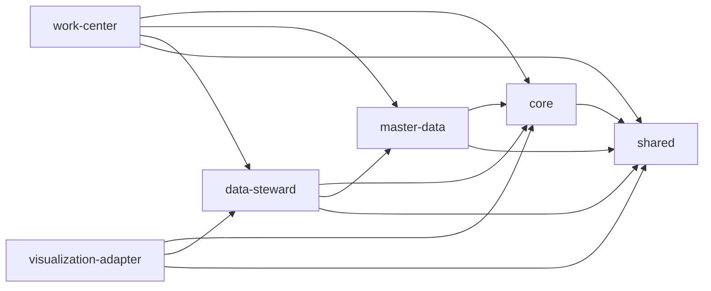

# 第一阶段开发基线

## 1. 目标

本文件用于把“总体方案”落成“可直接开工的工程基线”。后续所有开发 agent 在进入编码前，都必须以本文件作为统一约束，避免每个模块各自发明技术栈、目录结构和接口风格。

## 2. 第一阶段必须锁定的默认决策

以下决策默认生效，除非你明确要求调整：

### 2.1 代码仓库形态

- 采用单仓库管理。
- 仓库根目录固定为：
  - `docs/`
  - `backend/`
  - `frontend/`
  - `infra/`
  - `scripts/`

推荐结构：

```text
卓羽智能数据中台/
  docs/
  backend/
    pom.xml
    delivery-app/
    delivery-core/
    delivery-master-data/
    delivery-data-steward/
    delivery-work-center/
    delivery-visualization-adapter/
    delivery-shared/
  frontend/
    package.json
    src/
      app/
      router/
      stores/
      modules/
        core/
        master-data/
        data-steward/
        work-center/
  infra/
    docker-compose.yml
    nginx/
    sql/
  scripts/
    dev/
    ci/
```

### 2.2 后端技术基线

- JDK：`Java 21`
- 框架：`Spring Boot 3.3.x`
- 构建：`Maven 多模块`
- 安全：`Spring Security`
- ORM：`MyBatis-Plus`
- 数据库变更：`Flyway`
- 参数校验：`Hibernate Validator`
- API 文档：`springdoc-openapi`
- 对象映射：`MapStruct`
- JSON：`Jackson`

约束：

- 一期不拆微服务。
- 一期不引入重量级分布式中间件。
- 所有模块通过清晰的包边界和应用服务边界协作，不允许跨模块直接写 SQL。

### 2.3 前端技术基线

- Node：`20 LTS`
- 包管理：`pnpm`
- 框架：`Vue 3 + TypeScript`
- 构建：`Vite`
- UI：`Element Plus`
- 路由：`Vue Router`
- 状态管理：`Pinia`
- HTTP：`Axios`
- 图表：`ECharts`

约束：

- 前端信息架构优先对齐竞品的企业中后台习惯。
- 模块目录按业务域拆分，不允许把所有页面堆进 `views/`。
- 权限控制、项目上下文、字典缓存必须做成公共能力。

### 2.4 基础设施默认实现

- 数据库：`MySQL 8`
- 缓存：`Redis 7`
- 对象存储：`MinIO`
- 反向代理：`Nginx`
- 搜索：一期不作为必选组件

说明：

- 文档方案里保留“可替换”原则，但第一阶段编码必须先有一个默认实现，否则开发无法落地。
- 后续若客户现场要求国产化替换，只替换基础设施适配，不改业务模型。

### 2.5 部署与租户策略

- 一期默认部署模式：`单租户私有化部署`
- 数据隔离主维度：`project_id`
- 数据模型保留 `tenant_id` 扩展位，但一期不做多租户运营后台

说明：

- 这能兼顾后续产品化扩展和当前项目交付效率。

### 2.6 登录与认证策略

- 一期默认采用本地账号密码登录。
- 后端统一使用 `Spring Security + JWT Access Token + Refresh Token`。
- 前端默认使用 Bearer Token 模式接入。
- 预留后续企业 SSO 适配口，包括：
  - LDAP
  - OIDC
  - 企业微信或企业统一身份源

说明：

- 如果项目现场强依赖单点登录，我们后续只替换认证入口，不改 RBAC 和项目权限模型。

### 2.7 异步处理策略

- 一期不接 MQ。
- 文件处理、模型处理、集成发布统一走“任务表 + 应用内调度器”。
- 后端维护统一任务状态机：
  - `PENDING`
  - `RUNNING`
  - `SUCCESS`
  - `FAILED`

适用范围：

- 文件转存
- 模型处理
- 集成发布
- 对象抽取
- 批量导入导出

### 2.8 文件与对象存储策略

- 文件元数据落库，二进制文件落对象存储。
- 资源路径建议规则：

```text
/{projectCode}/{resourceKind}/{yyyy}/{MM}/{uuid}_{originFileName}
```

- 文件下载必须通过平台授权校验，不直接暴露裸桶地址。
- 文件删除采用逻辑删除优先，异步物理回收。

### 2.9 日志、审计与追踪策略

- 每个请求生成 `traceId`。
- 关键业务动作必须落 `AuditLog`。
- 审计事件命名规则：

```text
{domain}.{entity}.{action}
```

示例：

- `core.project.create`
- `masterdata.node.lock`
- `datasteward.integration.publish`
- `workcenter.delivery.bind`

### 2.10 默认国际化与时区

- 一期界面语言：`简体中文`
- 服务端统一存储时间：`UTC`
- 平台默认展示时区：`Asia/Shanghai`

## 3. 模块依赖规则

模块依赖必须单向，避免循环引用。



约束：

- `shared` 只放技术级公共能力，不放业务规则。
- `core` 不依赖任何业务模块。
- `master-data` 只能暴露标准查询与校验能力，不写下游资源逻辑。
- `data-steward` 不得反向修改主数据定义。
- `work-center` 只消费已发布标准和资源关系，不直接操作底层文件处理实现。

## 4. 后端分层约束

每个模块固定采用以下分层：

- `controller`
- `application`
- `domain`
- `infrastructure`
- `repository`
- `dto`

规则：

- `controller` 只做入参校验和返回组装。
- `application` 编排用例，不写底层 SQL。
- `domain` 放业务规则和值对象。
- `repository` 负责聚合持久化访问。
- `infrastructure` 放第三方适配、对象存储、缓存、任务执行器等实现。

## 5. 通用 API 规范

### 5.1 返回包结构

成功响应：

```json
{
  "code": "OK",
  "message": "success",
  "data": {},
  "traceId": "4c708d8e0c734a1cb2d6e2d67d8d4f21",
  "timestamp": "2026-05-06T04:30:00Z"
}
```

失败响应：

```json
{
  "code": "MASTERDATA_NODE_NOT_LOCKED",
  "message": "节点类型未锁定，当前页面不可用",
  "data": null,
  "traceId": "4c708d8e0c734a1cb2d6e2d67d8d4f21",
  "timestamp": "2026-05-06T04:30:00Z"
}
```

分页响应：

```json
{
  "code": "OK",
  "message": "success",
  "data": {
    "items": [],
    "pageNo": 1,
    "pageSize": 20,
    "total": 0
  },
  "traceId": "4c708d8e0c734a1cb2d6e2d67d8d4f21",
  "timestamp": "2026-05-06T04:30:00Z"
}
```

### 5.2 错误码规则

错误码统一采用大写下划线风格：

```text
{DOMAIN}_{SCENARIO}
```

示例：

- `CORE_AUTH_INVALID_CREDENTIAL`
- `CORE_PROJECT_NOT_FOUND`
- `MASTERDATA_NODE_NOT_LOCKED`
- `DATASTEWARD_RESOURCE_NOT_FOUND`
- `WORKCENTER_DELIVERY_PRECONDITION_FAILED`

### 5.3 接口命名规则

- 列表查询：`GET /api/{domain}/{resource}`
- 详情查询：`GET /api/{domain}/{resource}/{id}`
- 新增：`POST /api/{domain}/{resource}`
- 编辑：`PUT /api/{domain}/{resource}/{id}`
- 删除：`DELETE /api/{domain}/{resource}/{id}`
- 动作型接口：`POST /api/{domain}/{resource}/{id}:{action}`

示例：

- `POST /api/master-data/node-types/{id}:lock`
- `POST /api/data-steward/model-integrations/{id}:publish`

## 6. 数据库命名规范

- 表名：`模块_实体复数`，例如：
  - `core_projects`
  - `masterdata_section_nodes`
  - `datasteward_file_resources`
- 主键统一为 `id`
- 外键字段统一为 `{entity}_id`
- 时间字段统一为：
  - `created_at`
  - `updated_at`
- 操作人字段统一为：
  - `created_by`
  - `updated_by`
- 逻辑删除字段统一为 `deleted`

## 7. 第一阶段最低工程能力清单

在进入业务编码前，工程骨架至少要具备以下能力：

1. 后端多模块工程可启动
2. 前端中后台框架可启动
3. 本地一键依赖环境可启动
4. 登录、登出、获取当前用户接口可用
5. 项目切换上下文可用
6. 审计拦截器与 `traceId` 可用
7. OpenAPI 文档页面可访问
8. 数据库迁移脚本可执行
9. 最小化 CI 构建通过

## 8. 一期暂不实现但必须预留的点

- SSO 认证扩展口
- 对象存储替换扩展口
- 搜索引擎扩展口
- 3D 引擎适配 SPI
- OCR/AI 审核扩展口

## 9. 开工结论

从开发准备视角看，当前最需要补的不是再写更大的业务方案，而是把以上默认决策固化并体现在工程骨架里。只要这个基线不再摇摆，我们就可以进入第一阶段开发。
