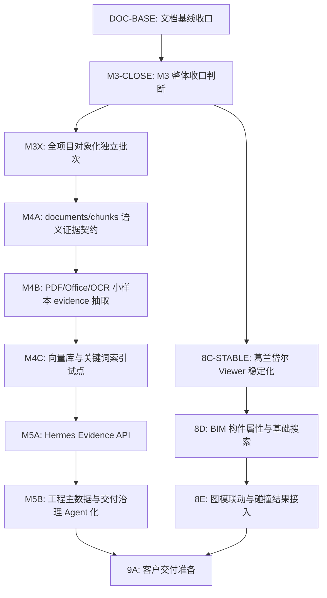

# 卓羽智能数据中台当前基线与后续路线

更新时间：2026-06-17

## 1. 文档定位

本文档用于固化当前真实开发基线，避免后续 agent 继续按早期一期、M1/M2 或旧 BIM 引擎路线理解项目。

本文档优先级：

1. 用于说明“当前平台已经做到什么、还不能承诺什么”。
2. 用于给后续开发 agent、测试 agent、产品评审和运维交接快速对齐。
3. 不替代运行期 OpenAPI；具体接口字段仍以 `/v3/api-docs` 和后端代码为准。

## 2. 当前阶段结论

当前主线已经完成 `M3：对象存储主链路` 收口，并在 `main` 形成可回滚基线。

当前可以确认：

- 平台已经不是单纯的 `NAS + MySQL 台账`。
- 平台已经具备 `NAS 侧 MinIO 对象存储 + MySQL 业务台账 + 受控 file-access` 主链路。
- 105 / `projectId=503` / `启航华居项目` 已完成 `2928 / 2928` 文件对象化，作为完整样板项目。
- 非 105 项目仍未全部对象化，当前状态需要通过覆盖率报告解释，不能伪装为全部完成。
- 葛兰岱尔 BIM Viewer 已具备真实 READY 模型识别与 Viewer 票据能力，但还不是完整构件级 BIM 平台。
- Hermes 仍未进入正文证据问答阶段，不能声称已经理解 PDF、DWG、RVT 或 Office 正文。
- 二期收口要求以 [14-phase2-closure-requirements.md](/Users/vc/Documents/数字化交付平台/docs/14-phase2-closure-requirements.md) 为准。

一句话口径：

> 卓羽智能数据中台当前已经完成对象存储主链路和 105 样板项目对象化，正在从文件资产治理进入语义证据与 BIM 深化前置阶段；客户交付版和 Hermes 正文问答仍需后续批次完成。

## 3. 已完成能力

### 3.1 平台与权限

- 员工手机号注册。
- 无项目权限等待授权。
- 管理员启用、停用、删除员工。
- 管理员分配员工可访问项目和项目角色。
- 普通员工只能看到授权项目。
- 关键写操作和高风险操作进入审计。

### 3.2 数据管家与文件管理

- 真实 NAS 项目扫描、登记、路径映射和资产台账。
- 文件管理器支持目录树、当前目录直达子项、项目全局搜索、左键选中、Ctrl/Command 多选、Shift 连选、右键菜单、双击打开。
- 文件夹和文件按 Windows 文件资源管理器口径展示。
- 新建文件夹、上传、移动、重命名、移入回收站等 NAS 写操作已受控灰度。
- 未入库真实 NAS 目录可展示为 `UNREGISTERED`，不伪造平台文件 ID。
- 文件访问通过受控 `file-access`，前端不展示真实 NAS 路径。

### 3.3 工程主数据与交付

- 工程主数据从模板演示调整为真实项目草案、确认、节点和交付标准驱动。
- 105 对象化后已具备工程树草案、文件归属、模型/图纸缺口分析和交付候选能力。
- 文档交付、图纸交付、缺失项、批量补交、审核、整改、复审、交付包 dry-run 已形成闭环。
- 文件归属和正式交付挂接已区分：所有文件可有归属地，但不是所有文件都强制成为正式交付资料。

### 3.4 对象存储

- 新增文件默认优先写入对象存储。
- 历史文件支持按项目、批次和任务对象化。
- 105 已完整对象化：`2928 / 2928`。
- 已对象化文件默认从 NAS 侧 MinIO 读取。
- `NAS_ONLY` 文件仍可用，但必须明确说明仍处于历史 NAS 链路。
- 对象副本不可读时不再静默 fallback 到 NAS 冒充成功。
- 全项目对象化覆盖率报告已可查询。

### 3.5 BIM 协同与葛兰岱尔

- 平台已接入葛兰岱尔 Station 配置。
- 105 项目可识别 READY 模型。
- BIM 协同综合驾驶舱能展示 `GLANDAR / 真实 Viewer 可用`。
- READY 模型可签发短期 Viewer 入口。
- Viewer 静态资源地址通过配置或安全推导生成。

## 4. 当前不能承诺的能力

以下能力尚未完成，不能对外宣称已经具备：

- 全部真实项目文件都已经对象化。
- Hermes 已经能回答文件正文问题。
- 平台已建立 documents / chunks 语义证据层。
- 平台已接入向量库或关键词索引。
- DWG / RVT / IFC 深度解析。
- BIM 构件级搜索、构件属性、构件定位、高亮、图模联动和碰撞检查。
- 客户交付版安装包、许可、备份恢复、运维手册和正式验收包。

## 5. 当前关键数据口径

以 M3G-9 验收报告为准：

- 可解释项目总数：`97`。
- `COMPLETED`：`1` 个项目，即 105。
- `PARTIAL`：`13` 个项目。
- `NAS_ONLY`：`2` 个项目。
- `EXCLUDED`：`81` 个项目。
- 平台总文件数：`41214`。
- 已对象化文件数：`2994`。
- 仍在历史 NAS 链路文件数：`38220`。
- 平台对象化覆盖率：`7.26%`。
- 105 对象化覆盖率：`100.00%`。

这些数字会随后续对象化批次变化；每次变更必须更新本文件或对应覆盖率报告。

## 6. 后续主线任务图

## 7. 后续批次建议

### DOC-BASE：文档基线收口

状态：当前批次。

目标：

- 更新 PRD、架构、路线、API 文档索引和任务图。
- 明确当前平台基线、未完成能力和后续开发顺序。
- 不写业务代码。

### M3-CLOSE：M3 整体收口判断

目标：

- 复核 M3A-M3G-9、8C-GD-F3、file-access、对象存储读取链路。
- 输出 M3 closure 文档。
- 明确对外表述边界：可以说对象存储主链路完成，不能说全项目对象化完成。

### M3X：全项目对象化独立批次

目标：

- 以 M3G-9 覆盖率报告为输入，继续推进 `PARTIAL` 和 `NAS_ONLY` 项目。
- 独立于文档收口，不混入 DOC-BASE。
- 继续坚持不移动、不删除、不重命名真实 NAS 原文件。

### M4：语义证据层

目标：

- 从对象化文件中小样本抽取 PDF / Office / OCR 证据。
- 建立 documents / chunks / evidence hash / permission scope。
- 不写 Hermes memory，不让 Hermes 绕过平台权限。

### M5：Hermes 受控证据问答

目标：

- Hermes 只通过平台 Evidence API 获取脱敏证据。
- 回答必须带证据来源和 Missing Evidence 说明。
- 不把 catalog-only 元数据伪装成正文理解。

### 8D/8E：BIM 深化

目标：

- 在葛兰岱尔 READY Viewer 稳定后，再推进构件属性、定位、高亮、图模联动和碰撞结果接入。

### 9A：客户交付准备

启动条件：

- M3 完成并收口。
- M4 / M5 有明确可验收能力或明确排除项。
- BIM Viewer 和客户部署边界稳定。
- 至少一个真实项目能完成资产、主数据、交付、对象存储、预览、档案目录全链路演示。

## 8. 文档同步规则

以下变化必须同步更新文档：

- 新增或修改 API、SQL View、Gateway response。
- 修改 `FileAssetView`、`ModelAssetView`、对象存储状态或 evidence 字段。
- 修改权限、脱敏、审计或 file-access 规则。
- 新增存储 provider、BIM provider、Hermes evidence 类型。
- 新增或修改项目、文件、模型、工程节点、交付绑定关键关联字段。
- 新增批次完成、批次冻结、批次后置或对外口径变化。

同步范围：

- 产品范围变化：更新 `docs/07-complete-delivery-prd.md`。
- 架构或数据流变化：更新 `docs/03-architecture-and-system-design.md`。
- 路线变化：更新 `docs/10-phase2-development-roadmap.md` 和本文档。
- API 变化：更新 `docs/12-api-contract-and-maintenance.md`，并确认 `/v3/api-docs` 可访问。
- 主 agent 状态变化：更新 `handoff/main-agent/status.md` 和相关任务图。

## 9. 当前文档批次禁止事项

- 不改业务代码。
- 不新增数据库迁移。
- 不触碰真实 NAS 文件。
- 不执行对象化迁移任务。
- 不新增 Hermes、BIM、parser、indexing 能力。
- 不把 105 样板完成说成全项目完成。
