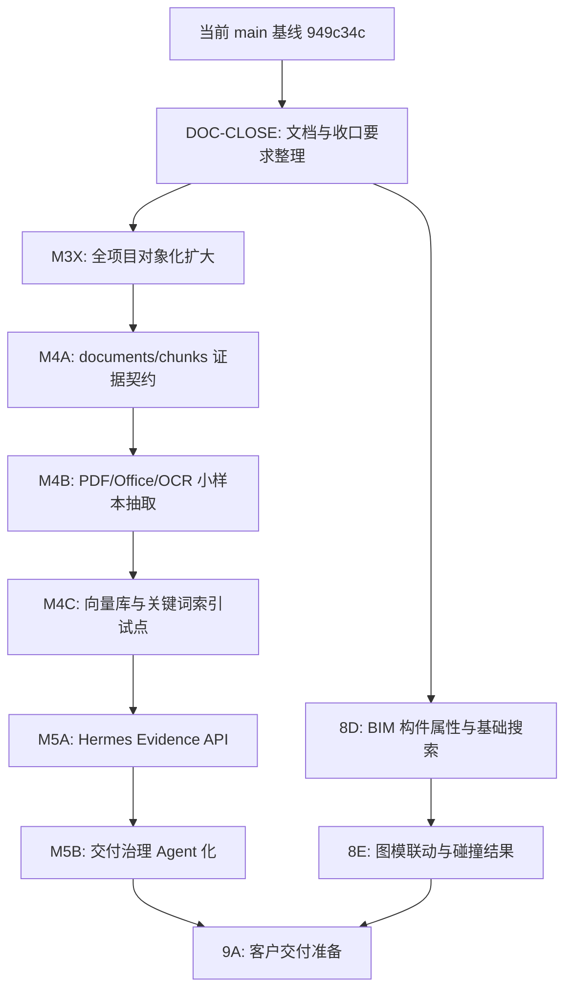

# 二期收口要求与当前基线

更新时间：2026-06-17

## 1. 文档定位

本文档用于回答两个问题：

1. 当前卓羽智能数据中台已经做到什么程度。
2. 二期后续怎样才算“可以收口”，哪些能力仍必须留到后续批次。

本文档不替代 OpenAPI，也不逐字段复制接口。接口字段仍以运行期 `/v3/api-docs` 和后端代码为准。

## 2. 当前主线基线

当前可用主线：

- Git 主线：`main`
- 当前基线提交：`949c34c`
- 当前品牌口径：`卓羽智能数据中台`
- 当前产品主线：`真实项目文件治理 + 对象存储主链路 + 工程主数据/交付闭环 + BIM 协同预览`

当前可以对内说明：

> 平台已经具备真实项目资产接入、文件管理、权限管理、对象存储主链路、105 样板项目完整对象化、工程主数据草案与交付闭环、葛兰岱尔 READY Viewer 入口等核心能力。

当前不能对外夸大为：

> 全公司所有项目已经对象化、Hermes 已经能理解文件正文、DWG/RVT 已经完成深度解析、平台已经是完整客户交付版。

## 3. 已完成且可作为二期基线的能力

### 3.1 项目与账号

- 超级管理员、员工账号、项目角色、项目授权已可用。
- 超级管理员可创建项目、软归档项目。
- 新项目会初始化对象存储工作区和工程树根节点。
- 归档项目不删除真实 NAS 文件，不删除 MinIO 对象。

### 3.2 项目启动台与前端壳层

- UX4 已收口为当前前端骨架基线。
- 主路径为：项目启动台 -> 项目工作台 -> 文件管理 / 工程主数据 / 交付闭环 / BIM 协同。
- 后续 UI 问题按小批次修复，不再把 UX4 无限扩大。

### 3.3 文件管理

- 文件管理器支持目录树、直接子项浏览、项目全局搜索、右键菜单、多选、双击打开。
- 支持上传、新建文件夹、移动、重命名、移入回收站等受控真实 NAS 写操作。
- 搜索模式按项目全局搜索文件，不再只查当前目录。
- 文件访问统一走 `file-access`，普通前端不展示真实 NAS 路径。

### 3.4 对象存储

- M3 对象存储主链路已完成收口。
- 新上传文件默认对象存储优先。
- 105 / `projectId=503` / `启航华居项目` 已完成 `2928 / 2928` 全量对象化。
- 已对象化文件默认通过 NAS 侧 MinIO 读取。
- `NAS_ONLY` 文件仍可走历史 NAS 链路，但必须明确展示状态。
- 对象副本不可读时不得静默 fallback 到 NAS 冒充成功。

### 3.5 工程主数据与交付闭环

- 工程主数据已从模板演示转向真实项目草案、确认、节点与交付标准驱动。
- 105 已具备文件归属、工程树草案、模型/图纸缺口分析和交付候选能力。
- 文档交付、图纸交付、缺失项、批量补交、审核、整改、复审、交付包 dry-run 已形成闭环。

### 3.6 BIM 协同

- 葛兰岱尔 READY Viewer 已接入当前平台。
- 105 可识别 READY 模型并签发 Viewer 入口。
- 已完成构件拾取、模型爆炸和属性代理的当前基线验证。
- 这仍不等于完整 BIM 构件级平台，图模联动、碰撞检查和复杂构件检索仍属后续批次。

## 4. 二期仍未完成的能力

这些能力不能混在“已完成”里：

- 非 105 项目全量对象化。
- PDF / Office / OCR 正文 evidence 抽取。
- DWG / RVT / IFC 深度解析。
- documents / chunks 语义证据层。
- 向量库和关键词索引。
- Hermes 受控正文证据问答。
- BIM 构件级搜索、定位、高亮、图模联动、碰撞结果接入。
- 客户交付安装包、备份恢复、运维手册、客户验收材料。

## 5. 二期收口分级

### 5.1 内部试运行收口

满足以下条件即可进入更大范围内部试用：

- `main` 可构建、可启动。
- 登录、项目启动台、文件管理、工程主数据、交付闭环、BIM 协同主链路无 P0/P1。
- 105 能完整演示：文件管理 -> 对象存储读取 -> 工程树 -> 交付候选 -> BIM Viewer。
- 至少一个非 105 真实项目能正常浏览、搜索、预览和解释对象化状态。
- 普通用户看不到真实 NAS 路径、bucket、object key、`storage_uri`、token、SQL。

### 5.2 二期功能收口

二期功能收口需要满足：

- M3X 全项目对象化批次有明确覆盖率报告和失败治理清单。
- 工程主数据能稳定支撑真实项目交付，而不是模板演示。
- 文件管理、对象存储、交付闭环、BIM 协同、账号权限均有稳定回归脚本。
- API 文档可访问，新增接口进入 `/v3/api-docs`。
- 关键页面在局域网试运行中无持续 P0/P1。

### 5.3 客户交付准备

客户交付准备不是当前立即状态。启动前必须满足：

- 内部试运行通过。
- 二期功能收口完成。
- 9A 部署、备份、恢复、日志、初始化、演示数据、验收文档均有方案。
- 明确哪些 Hermes / BIM 深化能力纳入客户版，哪些标为后续版本。

## 6. 后续任务图

## 7. 必跑收口检查

每次声明二期相关批次收口前，至少检查：

- 后端构建。
- 前端构建。
- 后端健康检查。
- `git diff --check`。
- 当前批次专项脚本。
- 文件访问安全回归。
- 对象存储读取回归。
- 涉及前端运行期文件时，确认新增组件、图片和脚本已纳入 Git。

## 8. 文档维护规则

后续如果新增或改变以下内容，必须同步更新文档：

- PRD 范围变化。
- 项目、文件、对象存储、工程树、交付、BIM、Hermes 的主链路变化。
- 新增接口或接口语义变化。
- 真实路径、对象 key、权限、审计、脱敏策略变化。
- 批次完成、冻结、后置或对外口径变化。

同步位置：

- 产品范围：`docs/07-complete-delivery-prd.md`
- 路线和基线：`docs/11-current-baseline-and-next-roadmap.md`
- 二期收口：本文档
- API 边界：`docs/12-api-contract-and-maintenance.md`
- 前端交互：`docs/13-ux4-frontend-architecture-baseline.md`
- 主 agent 状态：`handoff/main-agent/status.md`

