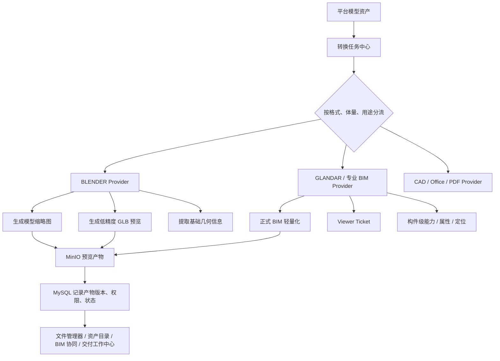

# Blender 模型加工与轻量预览辅助引擎待实现功能文档

更新时间：2026-06-17

适用范围：数字化交付平台模型资产、对象存储预览产物、BIM / 3D 轻量化辅助能力

状态：`待实现 / 待主 agent 裁定批次`

## 1. 背景与目标

当前平台已经形成：

- MinIO / 对象存储：保存文件本体与预览产物。
- MySQL：保存资产台账、权限、版本、交付关系、轻量化任务状态。
- 葛兰岱尔：承担正式 BIM 轻量化 Viewer 链路，尤其是 RVT、大模型、正式工程预览。
- 前端 Viewer：通过平台受控 ticket 打开模型，不直接暴露 NAS 路径、bucket、object key 或长期 token。

本功能目标不是用 Blender 替代葛兰岱尔，而是新增一个低成本的辅助模型加工能力：

1. 为平台模型资产批量生成缩略图。
2. 为 IFC / OBJ / FBX / GLB / GLTF 等通用模型生成网页可看的轻量 GLB 预览产物。
3. 作为平台模型转换器 provider 接入现有轻量化适配层。
4. 为不追求工程精度的小模型提供低成本在线预览。

一句话口径：

```text
Blender 是平台的免费模型加工与轻量预览辅助引擎，不是正式 BIM 主引擎。
```

## 2. 能力分层

| 层级 | 名称 | 推荐引擎 | 用途 | 产品口径 |
| --- | --- | --- | --- | --- |
| L0 | 模型缩略图 | Blender | 资产列表、文件管理器、模型卡片快速识别 | 可用于视觉识别，不代表模型已完成正式轻量化 |
| L1 | 轻量 GLB 预览 | Blender | 小模型、通用模型、低精度网页查看 | 可查看外观和大致空间关系，不作为正式工程审查依据 |
| L2 | 正式 BIM 轻量化预览 | 葛兰岱尔 / 专业 BIM 引擎 | RVT、大体量模型、正式项目预览、构件级能力 | 正式 BIM Viewer 链路，构件能力以引擎真实返回为准 |

前端必须区分展示：

- `缩略图`
- `轻量 GLB 预览`
- `正式 BIM 轻量化预览`

不得把 Blender 低精度预览包装成正式工程审查能力。

## 3. 总体架构



## 4. 推荐功能范围

### 4.1 L0：全量模型缩略图

目标：

- 对平台登记的模型资产创建缩略图任务。
- 支持批量生成、失败重试、状态查询。
- 缩略图作为预览产物写入 MinIO。
- MySQL 记录缩略图与源文件、对象版本、生成任务的关系。

推荐处理策略：

| 文件类型 | Blender 处理建议 | 说明 |
| --- | --- | --- |
| `.ifc` | 优先支持 | 适合试点，但需注意属性保留不是本阶段目标 |
| `.glb/.gltf` | 优先支持 | 适合直接加载与截图 |
| `.obj` | 优先支持 | 适合生成缩略图和 GLB |
| `.fbx` | 可支持 | 视 Blender 环境插件和材质兼容情况验收 |
| `.rvt` | 不直接支持 | 走葛兰岱尔或专业引擎，或等中间产物生成后再补缩略图 |
| `.dwg/.dxf` | 不作为 Blender 首批范围 | CAD 链路另行处理 |
| `.nwd/.nwc` | 不作为 Blender 首批范围 | 需专业引擎评估 |

### 4.2 L1：轻量 GLB 预览

目标：

- 对不追求工程精度的小模型生成网页可看的 `.glb`。
- 前端使用现有 Viewer 能力或新增通用 GLB Viewer 打开。
- 产物必须走平台受控访问，不暴露 MinIO object key。

适用场景：

- 设备外观模型。
- 家具、构件、展陈模型。
- 小型 IFC 样本。
- OBJ / FBX / GLB 通用三维资产。

禁止口径：

- 不称为正式 BIM 审查。
- 不承诺 Revit 参数完整保留。
- 不承诺构件级属性、族参数、专业编码、报建语义完整。
- 不承诺碰撞检查、图模联动、工程审批依据。

### 4.3 模型基础信息提取

Blender 转换任务可顺带提取低风险基础信息：

- bounding box / 模型尺寸。
- mesh 数量。
- 材质数量。
- 顶点数 / 三角面数量。
- 生成时间、转换耗时、Blender 版本。

这些信息可用于平台治理和性能预判，但不得替代 BIM 构件属性。

## 5. 平台接入方式

### 5.1 Provider 设计

在现有轻量化适配层中新增 provider：

```text
BLENDER
```

与现有 `GLANDAR` 并列，但定位不同：

| Provider | 主要职责 |
| --- | --- |
| `GLANDAR` | 正式 BIM 轻量化、RVT 试点、专业 Viewer、构件级能力 |
| `BLENDER` | 缩略图、通用模型转换、低精度 GLB 预览 |

### 5.2 任务类型建议

新增或扩展转换任务类型：

```text
MODEL_THUMBNAIL_GENERATE
MODEL_GLB_PREVIEW_CONVERT
MODEL_GEOMETRY_PROBE
```

任务状态建议：

```text
PENDING
RUNNING
READY
FAILED
SKIPPED
BLOCKED
```

`BLOCKED` 用于明确表达“格式不适合 Blender 处理”，例如 RVT / DWG 首批不走 Blender。

### 5.3 数据关系

每个产物必须能回指：

- `projectId`
- `assetUuid`
- 内部 `fileId`
- 原文件对象版本
- 转换任务 ID
- provider：`BLENDER`
- artifact type：`THUMBNAIL` / `GLB_PREVIEW` / `GEOMETRY_METADATA`
- artifact object version
- 权限范围
- checksum / size / content type

### 5.4 存储位置

Blender 产物统一写入 MinIO / 对象存储，不散落在本机临时目录。

建议逻辑路径口径：

```text
projects/{projectId}/assets/{assetUuid}/derived/blender/thumbnail/{version}.png
projects/{projectId}/assets/{assetUuid}/derived/blender/glb-preview/{version}.glb
projects/{projectId}/assets/{assetUuid}/derived/blender/metadata/{version}.json
```

注意：

- API 和前端不得返回真实 bucket / object key。
- 前端只拿平台签发的短期受控访问 URL 或 Viewer ticket。
- 临时工作目录必须可清理，不作为长期存储。

## 6. 后台执行建议

Blender 不应在普通 HTTP 请求线程里直接执行。建议采用后台 worker：

```text
用户 / 批处理创建任务
-> MySQL 写任务 PENDING
-> worker 领取任务
-> 从 StorageService 获取受控文件流或临时副本
-> 调用 blender --background --python 转换脚本
-> 写产物到 MinIO
-> 写 artifact / object version / task status
-> 清理临时文件
```

需要设置：

- 单任务超时时间。
- 并发上限。
- 单文件大小上限。
- 格式白名单。
- 临时目录容量检查。
- 失败原因记录。
- 重试次数上限。
- 任务审计。

## 7. 前端体验要求

文件管理器 / 资产目录 / BIM 模型列表中建议展示：

```text
缩略图：未生成 / 生成中 / 已生成 / 失败 / 不支持
轻量预览：不可用 / 生成中 / 可打开 / 失败 / 不支持
正式 BIM：需专业轻量化 / 已轻量化 / 不支持 / 失败
```

按钮建议：

- `生成缩略图`
- `生成轻量预览`
- `打开轻量预览`
- `提交正式轻量化`
- `查看正式 BIM`

用户提示必须诚实：

- Blender 预览：`轻量预览，不作为正式工程审查依据。`
- 葛兰岱尔预览：`正式 BIM 轻量化 Viewer，能力以转换产物和引擎返回为准。`

## 8. 安全与边界

必须遵守：

- 不移动、不删除、不重命名 NAS 原文件。
- 不绕过 StorageService 读取文件。
- 不向前端暴露 NAS 路径、bucket、object key、`storage_uri`、SQL、raw row、secret。
- 不让 Blender 直接访问 MySQL。
- 不让 Blender 直接扫描 NAS。
- 不把 GLB 低精度产物写入 Hermes memory。
- 不把几何预览说成语义理解。
- 不把缩略图生成说成 BIM 轻量化完成。

## 9. 分阶段落地建议

### BLC-0：契约补充与能力边界冻结

- [ ] 在轻量化引擎接入指南中登记 `BLENDER` provider 的定位。
- [ ] 明确 `BLENDER` 只做 L0 / L1，不替代 `GLANDAR` L2。
- [ ] 明确首批格式白名单：`.ifc`、`.glb`、`.gltf`、`.obj`，`.fbx` 可选。
- [ ] 明确首批不处理：`.rvt`、`.dwg`、`.nwd`、`.nwc`。

### BLC-1：Blender Worker PoC

- [ ] 在本机或容器中验证 `blender --background` 可执行。
- [ ] 用 1-3 个小模型样本生成 PNG 缩略图。
- [ ] 用 1-3 个小模型样本导出 GLB。
- [ ] 输出转换日志、耗时、失败原因。
- [ ] 临时文件可清理。

### BLC-2：平台任务与对象存储接入

- [ ] 接入平台任务中心。
- [ ] 任务从 StorageService 读取源文件。
- [ ] 产物写入 MinIO。
- [ ] MySQL 记录 artifact、object version、task status。
- [ ] 支持失败重试和幂等。

### BLC-3：前端状态与轻量 GLB Viewer

- [ ] 文件管理器展示缩略图状态。
- [ ] 模型列表展示轻量预览状态。
- [ ] 支持打开 GLB 轻量预览。
- [ ] 清晰区分 Blender 轻量预览和葛兰岱尔正式 BIM 预览。

### BLC-4：批量缩略图灰度

- [ ] 选择 105 或 100 项目少量模型做灰度。
- [ ] 统计成功数、失败数、跳过数、平均耗时。
- [ ] 输出不支持格式清单。
- [ ] 禁出字段扫描通过。

## 10. 验收标准

- [ ] 支持创建 Blender 缩略图任务。
- [ ] 支持创建 Blender GLB 轻量预览任务。
- [ ] 支持查询任务状态、失败原因和产物状态。
- [ ] 支持任务重试，重复执行不产生重复 active 产物版本。
- [ ] 产物写入 MinIO，对外只通过平台受控访问。
- [ ] 前端不暴露真实 NAS 路径、bucket、object key、`storage_uri`。
- [ ] RVT / DWG 首批不被误投给 Blender。
- [ ] Blender 预览不被标记为正式 BIM 轻量化。
- [ ] 葛兰岱尔现有 READY Viewer 不回归。
- [ ] file-access、对象优先读取、权限审计不回归。

## 11. 推荐主 agent PR Prompt

```text
请在不影响当前葛兰岱尔正式 BIM 轻量化主链路的前提下，规划并实现 Blender 模型加工与轻量预览辅助引擎。

目标：
1. 新增 BLENDER provider，定位为辅助模型加工引擎，不替代 GLANDAR。
2. 支持 L0 模型缩略图生成。
3. 支持 L1 小模型 / 通用模型 GLB 轻量预览产物生成。
4. 产物统一写入 MinIO / 对象存储，MySQL 记录产物版本、权限、状态和任务审计。
5. 前端明确区分“缩略图”“轻量 GLB 预览”“正式 BIM 轻量化预览”。

边界：
- 不处理 RVT / DWG 作为首批 Blender 输入。
- 不宣称 Blender 产物具备正式 BIM 工程审查能力。
- 不绕过 StorageService、file-access、对象存储权限和审计。
- 不暴露 NAS 路径、bucket、object key、storage_uri、SQL、secret。
- 不写 Hermes memory，不进入语义理解。

首批建议：
- 先做 BLC-0 / BLC-1，只完成契约和本地 PoC。
- 再由主 agent 裁定是否进入平台任务中心和前端接入。
```

## 12. 与现有文档关系

已检查现有待办 / 参考文档：

- `handoff/main-agent/backlog.md`：主 agent 总 backlog，已作为入口登记位置。
- `handoff/main-agent/lightweight-engine-integration-guide.md`：轻量化引擎接入指南，后续实现时应补充 `BLENDER` provider。
- `handoff/main-agent/m3-storage-evidence-chain-todo.md`：对象存储与证据链任务图，Blender 产物应沿用 M3E 预览产物对象化原则。
- `handoff/main-agent/phase2-current-roadmap.md`：当前阶段路线，Blender 批次命名和插入点由主 agent 裁定。

本文件是功能待实现文档，不代表已经启动实现批次。
