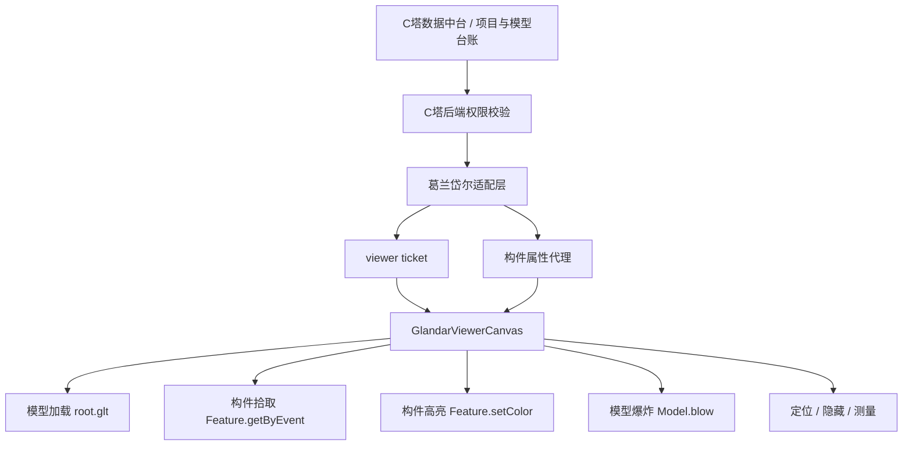

# 葛兰岱尔轻量化模型操作实现与 C塔交付中心复用报告

更新时间：2026-06-05
适用范围：卓羽智能数据中台、C塔交付中心、同源葛兰岱尔轻量化引擎接入方

## 1. 结论

当前平台已经把葛兰岱尔轻量化模型从“能打开模型”推进到“可交互模型”的阶段，已具备以下可复用能力：

- 模型加载：通过平台后端签发受控 viewer ticket，再在前端加载葛兰岱尔 `root.glt`。
- 构件选择：点击模型实体后，可获取构件 ID、Revit ID、批次信息等。
- 构件高亮：选中构件后使用引擎接口做黄色高亮。
- 构件属性：前端不直连葛兰岱尔 Station，而是通过平台后端代理获取属性。
- 模型爆炸：调用葛兰岱尔 `Model.blow(...)`，兼容单模型、多 tag 和无 tag 参数。
- 基础工具：主视角、显示/隐藏、定位、测量、清除等模型操作已接入。
- 安全边界：token、Station 地址、对象存储路径、NAS 路径均不直接交给前端业务页面。

对 C塔交付中心来说，最好的复用方式不是复制一套独立 Demo，而是复用当前平台已经收敛好的三层能力：

```text
C塔业务数据
  -> C塔数据中台 / 交付中心后端
  -> 葛兰岱尔适配层
  -> GlandarViewerCanvas 前端组件
  -> 统一模型操作体验
```

这样可以避免 C塔交付中心重新踩一遍“模型能打开但构件点不到、属性取不到、爆炸不生效、worker 路径丢失”的坑。

## 2. 关键术语用白话解释

| 名词 | 白话解释 | 在平台里的作用 |
| --- | --- | --- |
| 轻量化模型 | 把 RVT/IFC/NWD 等大模型转换成网页能打开的模型包 | 让浏览器不用装 Revit 也能看模型 |
| `root.glt` | 葛兰岱尔转换后的模型入口文件 | 前端 Viewer 加载它来显示模型 |
| Viewer ticket | 平台发给前端的一次性/受控看模型凭证 | 防止前端直接拿真实 token 或底层路径 |
| Worker | 浏览器后台线程脚本 | 用于拾取、射线计算、贴图等重计算任务 |
| PickWorker / RaycastWorker | 葛兰岱尔用于“点中构件”的 worker | 没有它们，经常会出现“未拾取到构件” |
| Feature | 引擎里的构件对象 | 对应 Revit 构件、模型构件或图元 |
| Feature ID | 葛兰岱尔返回的构件标识 | 用于高亮、属性查询、定位 |
| `Model.blow` | 葛兰岱尔模型爆炸接口 | 把模型按一定距离拆开，方便观察内部结构 |
| 构件属性 | 构件的名称、族、类型、Revit ID 等属性 | 后续做构件级审查、定位、报建校验的基础 |

## 3. 当前实现文件清单

### 3.1 前端 Viewer 主组件

核心文件：

```text
frontend/src/modules/visualization/components/GlandarViewerCanvas.vue
```

它负责：

- 加载葛兰岱尔引擎脚本。
- 创建 Viewer。
- 加载轻量化模型。
- 桥接 worker 静态资源。
- 注册点击拾取事件。
- 选中构件并高亮。
- 拉取构件属性。
- 执行模型爆炸、定位、隐藏、测量等操作。

### 3.2 前端 API

核心文件：

```text
frontend/src/modules/visualization/api/visualization.ts
```

已封装：

```text
issueLightweightViewerTicket(projectId, jobId)
fetchGlandarComponentProperties(projectId, jobId, featureId, revitId)
```

前端页面只调用平台后端接口，不直接调用葛兰岱尔 Station。

### 3.3 后端葛兰岱尔适配层

核心文件：

```text
backend/delivery-visualization-adapter/src/main/java/com/zhuoyu/delivery/visualization/controller/VisualizationAdapterController.java
backend/delivery-visualization-adapter/src/main/java/com/zhuoyu/delivery/visualization/engine/GlandarStationClient.java
```

已提供：

```text
POST /api/visualization-adapter/projects/{projectId}/lightweight-jobs/{jobId}:viewer-ticket
GET  /api/visualization-adapter/projects/{projectId}/lightweight-jobs/{jobId}/features/{featureId}/properties
```

后端对接葛兰岱尔 Station 的构件属性接口：

```text
/api/app/model/property-data-by-externalid
```

新提交转换任务时已带上：

```text
dbPropertyType = 1
```

这表示要求引擎生成属性库。没有属性库时，即使能点中构件，也可能查不到完整构件属性。

### 3.4 本地静态引擎资源

当前平台把部分葛兰岱尔引擎依赖放到前端静态目录：

```text
frontend/public/glandar-engine/worker/PickWorker.js
frontend/public/glandar-engine/worker/RaycastWorker.js
frontend/public/glandar-engine/worker/gleBatchTextureWorker.js
frontend/public/glandar-engine/worker/gleEdgesWorker.js
frontend/public/glandar-engine/third/worker/PickWorker.js
frontend/public/glandar-engine/third/worker/RaycastWorker.js
frontend/public/glandar-engine/third/worker/gleBatchTextureWorker.js
frontend/public/glandar-engine/third/worker/gleEdgesWorker.js
frontend/public/glandar-engine/third/draco_decoder.wasm
frontend/public/glandar-engine/third/draco_wasm_wrapper.js
frontend/public/glandar-engine/third/basis_transcoder.wasm
frontend/public/glandar-engine/third/basis_transcoder.js
```

这些文件的作用是让模型压缩、贴图、边线、拾取、射线计算等能力在平台前端可用。C塔复用时必须同步这些静态资源，否则最常见的问题就是：

- 模型能打开，但点击构件无反应。
- 弹出“未拾取到构件，请点击模型实体”。
- 控制台出现 worker、draco、basis、texture worker 相关错误。

## 4. 各功能如何实现

### 4.1 模型加载

流程：

```text
用户打开 BIM 协同页
-> 平台后端校验用户项目权限
-> 平台签发 viewer ticket
-> 前端加载葛兰岱尔引擎脚本
-> 前端创建 GlendaleEngine 实例
-> 前端调用 Model.add 加载 root.glt
-> 模型进入 READY / 可交互状态
```

关键实现点：

- `sitePath` 在嵌入平台时指向 `/glandar-engine/`。
- `secretKey` 使用后端返回的 `viewerTicket`。
- `Model.add(...)` 传入模型地址和模型 tag。
- 模型 tag 使用 `glandar-{jobId}`，后续爆炸、定位、操作都依赖这个 tag。

平台侧做了几件比较重要的兼容处理：

- 自动修正引擎静态路径。
- 加载后多次触发相机复位，避免模型出现但视角不对。
- 使用 `logarithmicDepthBuffer`，减少大模型深度闪烁。
- 嵌入模式下把引擎 worker 指向平台自己的静态资源。

### 4.2 构件选择 / 构件拾取

构件选择的核心不是普通浏览器点击，而是：

```text
浏览器点击位置
-> 转成引擎可识别的坐标
-> 调用 Feature.getByEvent
-> 引擎通过 PickWorker / RaycastWorker 判断点中了哪个构件
-> 返回 featureId / Revit ID / batchId 等信息
-> 平台高亮并展示构件信息
```

当前平台做了两套拾取兜底：

1. 引擎原生 `LEFT_CLICK` 事件：

```text
Public.event({ event: 'LEFT_CLICK', callback })
```

2. 平台自己的 pointer 事件兜底：

```text
PointerEvent
-> enginePickPositionCandidates(...)
-> Feature.getByEvent(...)
```

为什么要这么做：

- 不同引擎版本返回的点击坐标格式不完全一致。
- 有的版本使用浏览器坐标，有的版本使用 canvas 相对坐标。
- 高分屏或 canvas 缩放后，实际渲染像素和页面像素不同。

所以当前实现会尝试三组坐标：

```text
浏览器 clientX / clientY
canvas 内相对坐标
按 canvas 实际渲染尺寸缩放后的坐标
```

只要其中一个能被引擎识别，就可以拾取到构件。

### 4.3 构件高亮

拾取到构件后，平台优先调用：

```text
Feature.setColor({
  featureIds,
  color: 'rgb(255, 210, 64)'
})
```

如果当前引擎版本不支持 `setColor`，再兜底调用：

```text
Feature.highlight(...)
```

这样可以兼容不同 Demo / 不同 Station 打包出来的引擎版本。

### 4.4 构件属性

构件属性走后端代理，不让前端直接打 Station。

流程：

```text
前端选中构件
-> 前端拿到 featureId / revitId
-> 前端请求平台后端
-> 后端校验项目权限
-> 后端调用葛兰岱尔 Station 属性接口
-> 后端清洗成平台统一响应
-> 前端展示属性组
```

前端接口：

```text
GET /api/visualization-adapter/projects/{projectId}/lightweight-jobs/{jobId}/features/{featureId}/properties
```

Station 接口：

```text
/api/app/model/property-data-by-externalid
```

注意：

- 构件能被拾取，不代表一定有属性。
- 属性是否完整，取决于模型转换时是否生成属性库。
- 当前平台已在提交转换任务时加了 `dbPropertyType=1`。
- 历史转换任务如果没有属性库，可能需要重新转换。

### 4.5 模型爆炸

模型爆炸调用葛兰岱尔：

```text
Model.blow(...)
```

当前平台兼容多种参数写法：

```text
{ tag, type, value, showAxis }
{ modelTag, type, value, showAxis }
{ modelTags, type, value, showAxis }
{ tags, type, value, showAxis }
{ type, value, showAxis }
```

其中：

- `type`：爆炸方式，目前兼容 `SPHERE` 和 `LINEAR`。
- `value`：爆炸程度，范围按 `0 - 1` 控制。
- `showAxis`：显示引擎自带爆炸控制面板或轴辅助。
- `tag/modelTag/modelTags/tags`：告诉引擎要对哪个模型执行爆炸。

为什么要发多组参数：

- Demo0604 中使用的是 `api.Model.blow({ tag, type: 'LINEAR', showAxis: true, value })`。
- 另一个 RVT 预览 Demo 对多模型 tag 处理方式不完全一样。
- 当前平台为了兼容两种 Demo 和不同引擎版本，会依次尝试多种 payload。

这也是这次修复后爆炸能更稳定生效的原因。

### 4.6 显示、隐藏、定位、测量

这些能力都围绕选中构件和当前模型 tag 工作：

- 显示/隐藏模型：调用模型或构件可见性接口。
- 定位构件：基于选中构件执行视角聚焦。
- 距离/面积测量：切换引擎测量模式。
- 清除：清除测量结果或当前选择。

这些能力目前属于“Viewer 操作层”，不改变数据库、不改变模型文件、不写 NAS/MinIO。

## 5. C塔交付中心如何复用

### 5.1 推荐复用方式

推荐 C塔按“组件 + 适配层 + 数据契约”复用，而不是复制整个页面。

```text
可直接复用：
  GlandarViewerCanvas.vue
  /glandar-engine 静态资源
  viewer-ticket 接口模式
  component properties 代理接口模式
  构件拾取与爆炸兼容逻辑
  8C-GD-F4 专项测试脚本思路

需要 C塔自己接入：
  C塔项目 ID
  C塔模型文件 ID
  C塔轻量化任务 ID
  C塔权限上下文
  C塔数据中台中的项目 / 文件 / 构件业务关系
```

### 5.2 C塔最小接入条件

C塔要复用这套能力，至少要提供：

| 条件 | 说明 |
| --- | --- |
| `projectId` | C塔当前项目 ID |
| `modelFileId` | 平台中的模型文件 ID |
| `jobId` | 葛兰岱尔轻量化任务 ID |
| `modelAccessAddress` | 转换完成后的 `root.glt` 地址 |
| `viewerTicket` | 后端签发给前端的受控访问凭证 |
| `engineStaticBase` | 葛兰岱尔引擎静态资源地址，或使用平台本地 `/glandar-engine/` |
| 用户项目权限 | 后端必须知道当前用户能不能看这个项目/模型 |
| 属性接口代理 | 后端代理 `property-data-by-externalid` |

### 5.3 C塔不要直接复用的内容

不建议 C塔直接复用以下内容作为自己的业务真相：

- 卓羽当前项目库里的项目 ID。
- 卓羽当前 105 / 503 试点数据。
- 卓羽 NAS / MinIO 路径。
- 卓羽业务表中的交付节点。
- Demo 中写死的模型地址、token、root.glt 地址。

C塔的数据主线应保持：

```text
C塔数据中台是可信数据来源
BIM 报建 / C塔交付中心是其中的业务视图
葛兰岱尔 Viewer 只是模型展示与交互层
```

换句话说：模型 Viewer 可以同源复用，但 C塔的项目、文件、构件编码、字段标准和报建流程，必须从 C塔自己的数据中台来。

## 6. C塔复用落地步骤

### 第一步：复用静态引擎资源

把当前平台的以下目录同步给 C塔前端：

```text
frontend/public/glandar-engine/
```

重点确认：

- `glendale.v1.umd.js` 可加载。
- `worker/PickWorker.js` 可访问。
- `worker/RaycastWorker.js` 可访问。
- `third/worker/PickWorker.js` 可访问。
- `third/worker/RaycastWorker.js` 可访问。
- `draco` 和 `basis` wasm 资源可访问。

### 第二步：复用 Viewer 组件

复用：

```text
frontend/src/modules/visualization/components/GlandarViewerCanvas.vue
```

建议 C塔封装一个更薄的业务容器：

```text
CtowerBimViewerPage
  -> 获取 C塔项目 / 模型 / 轻量化任务
  -> 调用 C塔后端签发 viewer ticket
  -> 把 ticket 传给 GlandarViewerCanvas
```

不要把 C塔业务逻辑写死进 `GlandarViewerCanvas`，否则后续两个平台会互相污染。

### 第三步：复用后端适配接口模式

C塔后端应提供同类接口：

```text
POST /api/ctower/visualization/projects/{projectId}/lightweight-jobs/{jobId}:viewer-ticket
GET  /api/ctower/visualization/projects/{projectId}/lightweight-jobs/{jobId}/features/{featureId}/properties
```

接口职责：

- 校验当前用户是否能访问 C塔项目。
- 校验当前用户是否能访问这个模型。
- 后端读取 Station token。
- 后端调用葛兰岱尔 Station。
- 返回脱敏后的平台响应。

### 第四步：启用属性库

C塔提交新转换任务时也要带：

```text
dbPropertyType = 1
dbTreeType = 1
```

否则会出现：

- 构件可以点中。
- 但构件属性为空。
- 或只能拿到很少的图元信息。

### 第五步：复用测试脚本思路

当前平台脚本：

```text
scripts/dev/check-8c-gd-f4-component-pick-blow-properties.sh
```

C塔可以按这个脚本思路改一份：

```text
scripts/dev/check-ctower-glandar-viewer-interaction.sh
```

至少检查：

- Viewer 组件存在。
- Worker 地址桥接存在。
- `Feature.getByEvent` 拾取逻辑存在。
- `Model.blow` 多 payload 兼容逻辑存在。
- 后端属性代理接口存在。
- 提交转换任务时启用属性库。

## 7. 权限与安全边界

C塔复用时必须坚持：

- 前端不能保存葛兰岱尔 token。
- 前端不能直接调用 Station 私有接口。
- 前端不能暴露 NAS 路径。
- 前端不能暴露 MinIO bucket / object key。
- 前端不能直接拿数据库 raw row。
- 构件属性接口必须先经过 C塔后端权限校验。
- Viewer ticket 应尽量短时有效。
- 日志里不能打印 token。

推荐数据流：

```text
用户打开 C塔模型
-> C塔后端校验权限
-> C塔后端向 Station 申请/读取模型访问凭证
-> 前端只拿 viewer ticket 和模型访问地址
-> 用户点击构件
-> 前端拿 featureId
-> C塔后端校验权限后代理查询构件属性
```

## 8. 当前已验证现象

当前卓羽智能数据中台已验证：

- BIM 协同页可以打开葛兰岱尔 READY 模型。
- 点击模型实体可选中构件。
- 选中构件后能显示类似 `glandar-29^5156379` 的构件标识。
- 能提取 Revit ID，例如 `5156379`。
- 构件高亮可见。
- 构件属性接口已接入后端代理。
- 模型爆炸按钮可打开葛兰岱尔模型爆炸交互。
- 爆炸 payload 已包含 `showAxis: true`。
- `worker`、`third/worker`、`draco`、`basis` 静态资源已进入平台。
- 8C-GD-F4 专项脚本静态检查通过。

## 9. 已知限制

| 限制 | 当前原因 | 后续处理 |
| --- | --- | --- |
| 历史模型可能没有属性 | 转换时未启用属性库 | 重新提交转换任务，带 `dbPropertyType=1` |
| 构件拾取依赖 worker | PickWorker/RaycastWorker 缺失会导致拾取失败 | C塔必须部署同源 worker 静态资源 |
| 爆炸 UI 仍偏引擎原生 | 当前优先保证功能可用 | 后续可做平台化滑杆和模式切换 |
| 构件属性未绑定 C塔业务字段 | 当前只拿引擎属性 | C塔需要把 featureId/RevitId 映射到自己的构件编码 |
| 不等于构件级交付闭环 | 当前是 Viewer 交互层 | 后续再接工程树、报建标准、构件编码和审查规则 |

## 10. C塔复用检查清单

上线前建议逐项勾选：

- [ ] C塔后端可签发 viewer ticket。
- [ ] C塔前端可加载 `/glandar-engine/glendale.v1.umd.js`。
- [ ] C塔前端可访问 `PickWorker.js` 和 `RaycastWorker.js`。
- [ ] C塔模型 `root.glt` 可访问。
- [ ] C塔 Viewer 可显示模型。
- [ ] 单击模型实体能返回 featureId。
- [ ] 选中构件后能高亮。
- [ ] 选中构件后能显示 Revit ID 或等价构件 ID。
- [ ] 构件属性接口由 C塔后端代理。
- [ ] 属性接口不暴露 token、Station 内部地址和底层路径。
- [ ] 模型爆炸按钮可执行。
- [ ] 主视角、定位、隐藏、测量等基础操作可用。
- [ ] 历史转换模型如无属性，已明确标记“需重新转换”。
- [ ] C塔数据仍来自 C塔数据中台，不使用 Demo / Mock 数据冒充。

## 11. 对 C塔团队的建议

短期建议：

1. 先复用当前 Viewer 组件和 worker 静态资源，确保“打开、拾取、属性、爆炸”四件事稳定。
2. 不要先做复杂构件审查，先把构件 ID、Revit ID、属性组稳定拿出来。
3. 选 1 个 C塔试点模型，重新按 `dbPropertyType=1` 转换，作为稳定样板。
4. 用脚本固定验收，避免每次靠人工点模型判断是否成功。

中期建议：

1. 把 `featureId / RevitId` 映射到 C塔构件编码。
2. 把构件属性接入 C塔字段标准和 BIM 报建规则。
3. 让工程树节点、楼层、专业、构件编码与 Viewer 选中构件互相跳转。
4. 再接入构件级审查、报建校验和问题定位。

长期建议：

1. 建立 C塔自己的 `BIM 构件索引表`。
2. 建立模型版本与构件版本关系。
3. 将构件证据纳入后续 Hermes / Agent 受控证据链。
4. 做图模联动、构件搜索、问题定位和审查报告导出。

## 12. 最小复用架构图



## 13. 一句话总结

C塔交付中心可以复用当前平台的葛兰岱尔 Viewer 能力，但应只复用“轻量化展示和交互层”，不要复制卓羽项目数据。C塔自己的项目、文件、构件编码、字段标准和报建流程，仍应由 C塔数据中台统一提供；葛兰岱尔 Viewer 负责把模型打开、构件点中、属性取回、爆炸展示，并把这些操作结果交给 C塔业务流程使用。
