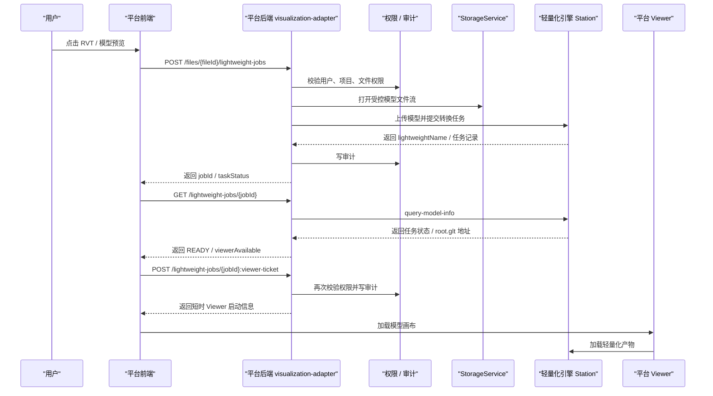

# 轻量化引擎接入指南：平台后端 API、转换任务与 Viewer 嵌入

更新时间：2026-06-01
适用范围：卓羽智能数据中台 BIM / 3D 轻量化引擎接入
参考实现：葛兰岱尔轻量化引擎 `GLANDAR`

## 1. 文档目的

这份文档给其他平台或轻量化引擎团队说明：

1. 卓羽智能数据中台如何把模型文件提交给轻量化引擎。
2. 平台后端已经提供哪些轻量化模型接口。
3. 前端如何在 BIM 协同管理中嵌入模型 Viewer。
4. 新引擎要接入平台时，需要实现哪些等价能力。
5. 哪些数据绝不能暴露给前端或第三方引擎。

用一句话概括当前架构：

```text
用户在平台选择模型
-> 平台校验项目和文件权限
-> 平台后端读取受控模型文件流
-> 平台后端提交给轻量化引擎
-> 平台保存转换任务和 viewer 映射
-> 前端通过平台签发的 viewer ticket 打开模型
```

## 2. 接入边界

### 2.1 平台负责什么

平台是所有权限和数据出口的总闸门，负责：

- 用户身份校验。
- 项目权限校验。
- 文件查看权限校验。
- 从 NAS / 对象存储读取模型文件。
- 向轻量化引擎提交转换任务。
- 查询轻量化任务状态。
- 保存平台文件与引擎任务的映射关系。
- 签发 Viewer 启动凭据。
- 记录审计日志。
- 对前端隐藏底层路径、bucket、object key 和 token。

### 2.2 引擎负责什么

轻量化引擎负责：

- 接收平台提交的模型文件。
- 执行模型轻量化转换。
- 提供转换状态查询能力。
- 提供可被浏览器 Viewer 加载的轻量化产物。
- 提供 Viewer SDK / 脚本 / 嵌入方式。
- 如果支持构件级能力，需要提供构件索引、构件拾取、构件属性或构件高亮等接口。

### 2.3 前端负责什么

前端只调用平台接口，不直接调用引擎后台接口。

前端负责：

- 展示模型是否需要轻量化。
- 发起转换任务。
- 轮询任务状态。
- 请求平台签发 Viewer ticket。
- 加载平台允许的 Viewer 地址或 Viewer SDK。
- 提供旋转、缩放、平移、测量、截图等交互入口。

### 2.4 明确禁止

任何引擎接入都必须遵守：

- 前端不得拿到真实 NAS 路径。
- 前端不得拿到 `storage_uri`、bucket、object key。
- 前端不得拿到引擎长期 token。
- 引擎不得直连平台 MySQL。
- 引擎不得绕过平台直接扫 NAS。
- 引擎不得绕过平台直接读取 MinIO / S3 底层目录。
- 轻量化转换不等于语义理解，不得宣称 Hermes 已经理解模型正文。
- 当前构件级属性必须以引擎真实返回为准，不能在平台伪造。

## 3. 总体数据流



## 4. 平台后端接口总览

平台接口统一使用：

```http
/api/visualization-adapter/projects/{projectId}
```

响应外壳遵循平台统一结构：

```json
{
  "code": "OK",
  "message": "success",
  "traceId": "平台链路追踪编号",
  "data": {}
}
```

### 4.1 项目可视化上下文

```http
GET /api/visualization-adapter/projects/{projectId}/context
```

用途：

- 查询当前项目已发布模型数量。
- 查询管理对象数量。
- 为后续定位、高亮、图模联动提供上下文。

典型返回字段：

| 字段 | 含义 |
| --- | --- |
| `projectId` | 项目 ID |
| `publishedModelCount` | 已发布模型数量 |
| `managedObjectCount` | 管理对象数量 |
| `models[]` | 已登记模型上下文 |
| `objects[]` | 管理对象上下文 |

### 4.2 BIM 协同大屏数据

```http
GET /api/visualization-adapter/projects/{projectId}/digital-twin-dashboard
```

用途：

- BIM 协同管理页的数据入口。
- 返回项目资产、模型、图纸、质量风险、交付进度、活动、操作摘要等真实平台数据。

注意：

- 这个接口返回平台业务统计，不返回真实模型路径。
- 页面上的驾驶舱数据应优先从此接口读取，不使用演示假数据。

### 4.3 模型集成轻量化状态

```http
GET /api/visualization-adapter/projects/{projectId}/model-integrations/{integrationId}/lightweight-status
```

用途：

- 查询某个模型集成记录是否已具备轻量化预览条件。
- 适用于已有 `ModelIntegration` 业务记录。

关键字段：

| 字段 | 含义 |
| --- | --- |
| `engineMode` | 当前引擎模式，例如 `MOCK` / `GLANDAR` |
| `lightweightStatus` | 平台轻量化状态 |
| `taskStatus` | 转换任务状态 |
| `viewerAvailable` | 是否可打开 Viewer |
| `conversionRequired` | 是否需要先转换 |
| `componentIndexStatus` | 构件索引状态 |
| `supportedOperations[]` | 当前支持的操作 |
| `forbiddenOperations[]` | 当前禁止的操作 |
| `blockedReason` | 不可用原因 |

### 4.4 模型集成轻量化计划

```http
GET /api/visualization-adapter/projects/{projectId}/model-integrations/{integrationId}/lightweight-plan
```

用途：

- 返回轻量化前置条件和计划。
- 告诉前端当前是可转换、缺配置、缺文件、还是仍处于 mock 状态。

关键字段：

| 字段 | 含义 |
| --- | --- |
| `dryRun` | 是否只是预检查 |
| `taskCreated` | 是否已创建任务 |
| `engineBindingRequired` | 是否需要真实引擎配置 |
| `realConversionExecuted` | 是否已执行真实转换 |
| `nasFileTouched` | 是否触碰 NAS 文件，正常应为 `false` |
| `requiredConditions[]` | 必要条件 |
| `futureSteps[]` | 后续步骤 |
| `riskWarnings[]` | 风险提示 |

### 4.5 按模型集成创建轻量化任务

```http
POST /api/visualization-adapter/projects/{projectId}/model-integrations/{integrationId}/lightweight-jobs
```

用途：

- 对已有模型集成记录创建轻量化任务。
- 适合从“模型集成”模块发起转换。

### 4.6 按文件创建轻量化任务

```http
POST /api/visualization-adapter/projects/{projectId}/files/{fileId}/lightweight-jobs?force=false
```

用途：

- 直接对文件资产创建轻量化任务。
- 适合从“文件管理器”中双击或右键 RVT 文件发起转换。

`force` 含义：

- `false`：如果已有可复用任务，优先复用。
- `true`：强制重新提交任务，旧任务会被标记为非 active / superseded。

关键返回字段：

| 字段 | 含义 |
| --- | --- |
| `jobId` | 平台轻量化任务 ID |
| `modelFileId` | 平台文件 ID |
| `assetUuid` | 可在后续版本中作为公开资产 ID |
| `lightweightName` | 引擎侧轻量化任务名 |
| `uniqueCode` | 平台生成的任务唯一编码 |
| `taskStatus` | `SUBMITTED` / `UPLOADED` / `RUNNING` / `READY` / `FAILED` |
| `progressPercent` | 进度 |
| `viewerAvailable` | 是否可预览 |
| `blockedReason` | 不可用原因 |

### 4.7 查询轻量化任务

```http
GET /api/visualization-adapter/projects/{projectId}/lightweight-jobs/{jobId}
```

用途：

- 查询平台保存的轻量化任务。
- 平台会按需刷新引擎侧任务状态。

关键字段：

| 字段 | 含义 |
| --- | --- |
| `jobId` | 平台任务 ID |
| `lightweightName` | 引擎任务名 |
| `taskStatus` | 当前状态 |
| `progressPercent` | 进度 |
| `modelAccessAddress` | Viewer 加载地址，需谨慎返回 |
| `viewerAvailable` | 是否可用 |
| `lastErrorCode` | 最近错误码 |
| `lastErrorMessage` | 最近错误说明 |
| `updatedAt` | 更新时间 |

说明：

- 当前 PoC 中 `modelAccessAddress` 用于 Viewer 加载轻量化产物。
- 生产版建议改为平台代理地址或短时 launch 地址，避免直接暴露引擎内部产物地址。

### 4.8 签发 Viewer Ticket

```http
POST /api/visualization-adapter/projects/{projectId}/lightweight-jobs/{jobId}:viewer-ticket
```

用途：

- 在用户打开 Viewer 前，再次校验权限。
- 只有任务 `READY` 且 `viewerAvailable=true` 时才签发。
- 该接口会写审计。

关键字段：

| 字段 | 含义 |
| --- | --- |
| `viewerAvailable` | 是否可打开 Viewer |
| `ticketIssued` | 是否已签发 |
| `viewerTicket` | 平台 Viewer ticket |
| `expiresAt` | 过期时间 |
| `launchUrl` | 平台 Viewer 页面入口 |
| `engineStaticBase` | 引擎 Viewer 静态资源根地址 |
| `modelAccessAddress` | 轻量化模型加载地址 |
| `supportedOperations[]` | 支持的 Viewer 操作 |
| `forbiddenOperations[]` | 禁止的 Viewer 操作 |

安全说明：

- `viewerTicket` 必须短时有效。
- 平台不得把 Station 长期 token 返回给前端。
- 如引擎需要 Viewer Session，应由引擎提供短时 Viewer Session，或由平台后端代理生成短时启动凭据。
- 前端不得保存长期凭据。

### 4.9 葛兰岱尔 RVT 试点文件列表

```http
GET /api/visualization-adapter/projects/{projectId}/glandar/rvt-pilot-files
```

用途：

- 返回当前项目 RVT 试点文件。
- 当前 105 项目试点包含 10 个 RVT 文件。

关键字段：

| 字段 | 含义 |
| --- | --- |
| `fileId` | 平台文件 ID |
| `assetUuid` | 平台资产 UUID |
| `fileName` | 文件名 |
| `modelFormat` | 模型格式 |
| `sizeBytes` | 文件大小 |
| `latestJobId` | 最近轻量化任务 |
| `taskStatus` | 任务状态 |
| `viewerAvailable` | 是否可打开 |
| `statusLabel` | 业务化状态文案 |

### 4.10 批量提交 RVT 试点文件

```http
POST /api/visualization-adapter/projects/{projectId}/glandar/rvt-pilot-files:submit?force=false
```

用途：

- 批量提交 10 个 RVT 试点文件。
- 仅用于试点，不代表全项目全量转换。

## 5. 葛兰岱尔 Station 参考接口

当前参考引擎是葛兰岱尔 Station。其他引擎不需要完全一样，但必须提供等价能力。

### 5.1 配置项

平台后端通过安全配置读取：

```text
BIM_ENGINE_PROVIDER=GLANDAR
GLANDAR_STATION_API_BASE=http://<engine-api-host>:18086
GLANDAR_STATION_WEB_BASE=http://<engine-web-host>:18087
GLANDAR_TOKEN=<secure-injection-only>
GLANDAR_UPLOAD_CHUNK_SIZE_MB=2
```

同一配置也支持 Spring property 名：

```text
delivery.bim.engine.provider
delivery.bim.engine.glandar.station-api-base
delivery.bim.engine.glandar.station-web-base
delivery.bim.engine.glandar.token
delivery.bim.engine.glandar.upload-chunk-size-mb
```

默认值：

```text
BIM_ENGINE_PROVIDER=MOCK
```

也就是说，不显式启用 `GLANDAR` 时，平台不会提交真实转换。

### 5.2 上传模型文件

小文件当前使用：

```http
POST {GLANDAR_STATION_API_BASE}/api/app/model/upload-file
Header: Token: <secure token>
Content-Type: multipart/form-data
```

大文件当前使用：

```http
POST {GLANDAR_STATION_API_BASE}/api/app/model/SplitUploadFile
Header: Token: <secure token>
Content-Type: multipart/form-data
```

平台提交的核心参数：

| 参数 | 含义 |
| --- | --- |
| `file` | 模型文件或分片 |
| `chunk` | 分片序号，大文件时使用 |
| `chunks` | 分片总数，大文件时使用 |
| `input` | JSON 参数 |

`input` 中核心字段：

| 字段 | 含义 |
| --- | --- |
| `Name` | 上传文件名 |
| `LightweightName` | 轻量化任务名 |
| `InitiatingUser` | 发起人，平台固定为 `delivery-platform` |
| `UniqueCode` | 平台任务唯一编码 |
| `Priority` | 优先级 |
| `ModelUploadUrl` | 预留字段，当前为空 |
| `OtherInfo` | 平台安全上下文，例如 projectId / fileId / assetUuid |
| `ConfigJson` | 引擎转换配置 |

当前 BIM 模型使用：

```text
engineType=2
```

CAD 可扩展使用：

```text
engineType=1
```

### 5.3 查询转换状态

```http
POST {GLANDAR_STATION_API_BASE}/api/app/model/query-model-info?LightweightName={lightweightName}
Header: Token: <secure token>
```

平台状态映射：

| Station 返回 | 平台状态 |
| --- | --- |
| `status == 100` | `READY` |
| `status < 0` | `FAILED` |
| 未返回任务明细 | `RUNNING` |
| 其他状态 | `RUNNING` |

平台默认模型产物地址：

```text
{GLANDAR_STATION_API_BASE}/Tools/output/model/{lightweightName}/root.glt
```

如果 Station 返回 `localhost` 或 `127.0.0.1`，平台会替换为配置的 `stationApiBase`。

## 6. 平台数据库映射

当前轻量化任务表：

```text
visualization_lightweight_jobs
```

核心字段：

| 字段 | 含义 |
| --- | --- |
| `id` | 平台轻量化任务 ID |
| `project_id` | 项目 ID |
| `integration_id` | 模型集成 ID，可为空 |
| `file_id` | 平台文件 ID |
| `asset_uuid` | 平台资产 UUID |
| `engine_provider` | 引擎供应商，例如 `GLANDAR` |
| `engine_type` | 引擎类型，BIM 为 `2` |
| `lightweight_name` | 引擎任务名 |
| `unique_code` | 平台任务唯一编码 |
| `status` | 平台任务状态 |
| `progress_percent` | 进度 |
| `model_access_address` | 轻量化产物访问地址 |
| `viewer_available` | Viewer 是否可用 |
| `last_error_code` | 最近错误码 |
| `last_error_message` | 最近错误说明 |
| `station_record_json` | 引擎原始返回记录，仅后端排障使用 |

不得保存：

- Station 长期 token。
- NAS 真实绝对路径。
- MinIO bucket / object key 明文给前端使用。

## 7. 前端嵌入方式

### 7.1 前端只调用平台 API

前端 API 封装位于：

```text
frontend/src/modules/visualization/api/visualization.ts
```

核心函数：

| 函数 | 平台接口 |
| --- | --- |
| `fetchGlandarRvtPilotFiles(projectId)` | `GET /glandar/rvt-pilot-files` |
| `submitGlandarRvtPilotFiles(projectId, force)` | `POST /glandar/rvt-pilot-files:submit` |
| `createFileLightweightJob(projectId, fileId, force)` | `POST /files/{fileId}/lightweight-jobs` |
| `fetchLightweightJob(projectId, jobId)` | `GET /lightweight-jobs/{jobId}` |
| `issueLightweightViewerTicket(projectId, jobId)` | `POST /lightweight-jobs/{jobId}:viewer-ticket` |

### 7.2 Viewer 页面

当前平台 Viewer 页面：

```text
/visualization/glandar-viewer?projectId={projectId}&jobId={jobId}&fileName={fileName}
```

嵌入式 Viewer 页面：

```text
/visualization/glandar-viewer-embed?projectId={projectId}&jobId={jobId}&fileName={fileName}&embedded=1
```

嵌入式页面只应该渲染：

- 模型画布。
- 极简工具层。
- 必要错误提示。

不应该渲染：

- 平台左侧菜单。
- 平台顶部栏。
- 大块说明卡片。
- 真实路径或技术调试信息。

### 7.3 Viewer 初始化流程

前端 Viewer 的标准流程：

```text
读取 projectId / jobId
-> 调用 viewer-ticket 接口
-> 获取 engineStaticBase / modelAccessAddress / viewerTicket
-> 加载葛兰岱尔 Glendale 脚本
-> 创建 Viewer 引擎实例
-> Model.add 加载 root.glt
-> 绑定鼠标旋转、平移、缩放
-> 按能力开放工具按钮
```

当前 Viewer 组件：

```text
frontend/src/modules/visualization/components/GlandarViewerCanvas.vue
```

当前页面组件：

```text
frontend/src/modules/visualization/pages/GlandarModelPreviewPage.vue
```

## 8. Viewer 操作能力分层

### 8.1 当前已接入的基础能力

| 能力 | 状态 | 说明 |
| --- | --- | --- |
| 模型加载 | 已接入 | 加载 `root.glt` |
| 鼠标旋转 | 已接入 | 左键拖动 |
| 鼠标平移 | 已接入 | 右键拖动 |
| 滚轮缩放 | 已接入 | 滚轮 |
| 主视角 / 适配 | 已接入 | Viewer 工具按钮 |
| 截图 | 已接入 | 前端保存画布截图 |
| 距离 / 面积测量 | 已接入入口 | 依赖引擎测量 API |

### 8.2 需要引擎产物支持的构件能力

以下能力不能只靠平台前端实现，必须由引擎输出构件索引或拾取数据：

| 能力 | 需要引擎提供 |
| --- | --- |
| 单击选中构件 | featureId / batchId / pick 结果 |
| 构件高亮 | Feature.setColor 或等价 API |
| 构件隐藏 / 显示 | Feature.setVisible 或等价 API |
| 构件定位 | Feature.zoomTo 或等价 API |
| 构件面积 / 体积 | 构件几何统计或测量 API |
| 完整构件属性 | RevitId、族、类型、楼层、材质等属性索引 |

当前葛兰岱尔 10 个 RVT 试点产物可以渲染模型，但部分输出文件缺少可用构件索引。因此平台已做诚实兜底：没有构件索引时，构件选择、隐藏、爆炸等按钮应显示“当前模型不支持构件级操作”，不能假装可用。

## 9. 新引擎接入要求

如果后续接入其他轻量化引擎，至少需要提供这些能力。

### 9.1 后端能力

新引擎需要提供：

1. 健康检查接口。
2. 提交转换任务接口。
3. 查询转换任务接口。
4. Viewer 启动信息或产物访问地址。
5. 错误码和错误信息。
6. 支持格式列表。
7. 文件大小限制和并发限制。
8. 认证方式。

### 9.2 状态映射

新引擎必须能映射到平台状态：

| 平台状态 | 含义 |
| --- | --- |
| `NOT_STARTED` | 未提交 |
| `SUBMITTED` | 已提交 |
| `UPLOADED` | 已上传 |
| `RUNNING` | 转换中 |
| `READY` | 可预览 |
| `FAILED` | 转换失败 |
| `SUPERSEDED` | 已被新任务替代 |

### 9.3 Viewer 能力声明

新引擎需要明确告诉平台：

- 是否支持模型加载。
- 是否支持构件拾取。
- 是否支持构件属性。
- 是否支持高亮。
- 是否支持隐藏 / 显示。
- 是否支持模型爆炸。
- 是否支持距离 / 面积测量。
- 是否支持漫游。
- 是否支持截图。

平台前端应根据能力声明显示或禁用按钮。

## 10. 推荐实现步骤

### 步骤 1：接入配置

新增引擎配置，例如：

```text
BIM_ENGINE_PROVIDER=NEW_ENGINE
NEW_ENGINE_API_BASE=http://<engine-api>
NEW_ENGINE_WEB_BASE=http://<engine-web>
NEW_ENGINE_TOKEN=<secure-injection-only>
```

### 步骤 2：实现引擎客户端

参考：

```text
backend/delivery-visualization-adapter/src/main/java/com/zhuoyu/delivery/visualization/engine/GlandarStationClient.java
```

新客户端需要实现：

- `upload` 或 `submit`。
- `query`。
- 状态转换。
- 错误脱敏。

### 步骤 3：复用平台轻量化任务接口

不要为每个引擎新建一套前端 API。优先复用：

```http
POST /files/{fileId}/lightweight-jobs
GET  /lightweight-jobs/{jobId}
POST /lightweight-jobs/{jobId}:viewer-ticket
```

### 步骤 4：接入 Viewer

新引擎可以：

- 提供 JS SDK，由平台页面加载。
- 提供 iframe viewer，由平台签发短时 URL。
- 提供 glTF / 3D Tiles / 自有产物，由平台 Viewer 加载。

不管哪种方式，都必须由平台先校验权限。

### 步骤 5：专项验收

每个新引擎至少需要一个专项脚本，验证：

- 未配置时不 500。
- 配置后可提交转换。
- 可查询状态。
- 可签发 viewer ticket。
- 前端可打开 Viewer。
- 响应不泄露敏感字段。

## 11. 安全与脱敏清单

任何接口、页面、日志和报告都不得返回：

```text
/Volumes
smb://
nas://
storage_uri
bucket
object_key
Token
secret
SQL
raw row
真实 NAS 绝对路径
```

可以返回：

- 平台文件 ID。
- 平台资产 UUID。
- 文件名。
- 文件类型。
- 文件大小。
- 业务状态。
- 脱敏相对目录提示。
- 短时 Viewer ticket。
- 业务化失败原因。

## 12. 验收清单

### 12.1 后端验收

- 后端构建通过。
- 健康检查通过。
- 未配置引擎时返回业务化不可用原因，不 500。
- 配置引擎后可提交模型转换。
- 可查询转换状态。
- 可生成 viewer ticket。
- 审计日志记录提交和打开 Viewer。
- 禁出字段扫描通过。

### 12.2 前端验收

- 文件管理器可识别 RVT / BIM 模型。
- 未转换模型显示“需轻量化”。
- 转换中显示进度。
- 已转换模型显示“已轻量化”。
- 双击已转换模型可打开 Viewer。
- BIM 协同管理页可以在原模型预览框中嵌入 Viewer。
- Viewer 不显示平台左侧菜单和顶部栏。
- Viewer 背景、按钮和空状态符合平台主题。

### 12.3 引擎验收

- 引擎 API 可访问。
- 引擎 token 仅后端持有。
- 引擎可接收平台上传的模型文件。
- 引擎可返回转换状态。
- 引擎可提供 Viewer 可加载产物。
- 构件级能力必须有真实构件索引支撑。

## 13. 当前葛兰岱尔试点状态

当前分支中，葛兰岱尔接入已完成这些能力：

- RVT 文件提交转换。
- 10 个 105 项目 RVT 试点模型状态展示。
- 轻量化任务查询。
- Viewer ticket 签发。
- 平台 BIM 协同页嵌入 Viewer。
- 模型基础浏览：旋转、平移、缩放、适配。

当前仍需引擎团队确认或补齐：

- 当前部分 `root.glt` 产物可渲染，但缺少稳定构件索引。
- 单击拾取构件、爆炸、构件隐藏、构件属性浮窗等能力不能由平台单方面保证。
- 如果引擎后续输出 feature/batch/revit/property 索引，平台再开放构件级按钮。

## 14. 给其他平台的最小接入结论

其他平台若要接入轻量化引擎，不需要复制卓羽智能数据中台的所有业务模块，只需要实现这条最小链路：

```text
平台文件 ID
-> 权限校验
-> 读取受控模型文件流
-> 提交轻量化任务
-> 保存任务 ID 与文件 ID 的映射
-> 查询任务状态
-> 签发短时 Viewer 入口
-> 前端加载 Viewer
```

真正不能省的是：

- 权限校验。
- 审计。
- 状态表。
- viewer ticket。
- 敏感字段脱敏。
- 引擎状态到平台状态的映射。

这些做好后，换其他轻量化引擎时，主要替换的是“引擎客户端”和“Viewer 适配层”，平台业务接口可以保持稳定。
