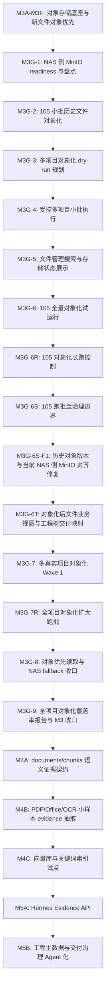

# M3-M5 Storage And Evidence Task Graph

更新时间：2026-05-29

## 0. 使用规则

本文件是 `卓羽智能数据中台` 后续对象存储、语义证据与 Hermes 受控问答路线的主任务图。

规则：

- 每完成一个批次，由主 agent 在本文件打勾。
- M3 不因单个小批完成而收口，必须满足 `M3 收口闸门`。
- M4 / M5 只能在 M3 收口后启动，除非用户明确授权做纯文档或纯契约预研。
- Hermes 不得绕过平台 Gateway，不得直连 MySQL、NAS、MinIO、Qdrant 或 OpenSearch。
- 对象存储完成不等于 AI 理解完成；catalog metadata 不等于正文 evidence。
- 不得暴露 `/Volumes`、`smb://`、`nas://`、`storage_uri`、bucket、object key、SQL、raw row、token、secret。

## 1. 总任务图

## 2. M3：对象存储主链路

### 已完成

- [x] M3A：对象存储与 StorageService 基线
- [x] M3B：105 小样本对象存储镜像迁移
- [x] M3C-0：资产存储与证据链契约冻结
- [x] M3C-1：资产 UUID 与存储状态统一
- [x] M3C：对象存储迁移任务中心与批量策略
- [x] M3D：真实 NAS 小范围灰度镜像
- [x] M3E：预览与转换产物对象化
- [x] M3F：新文件对象存储优先写入
- [x] M3G-1：NAS 侧 MinIO readiness、全项目盘点、单项目 dry-run
- [x] M3G-2：105 项目历史文件对象化小批灰度
- [x] M3G-3：多真实项目对象化规划 dry-run
- [x] M3G-4：受控多项目小批对象化执行
- [x] M3G-5：文件管理器项目全局搜索与存储展示
- [x] M3G-5-F1：URL 搜索 query 显示文件夹问题修复

### 当前执行

- [x] M3G-6：105 项目全量对象化试运行
- [x] M3G-6R：105 对象化长跑执行与进度控制
- [x] M3G-6S：105 对象化持续跑批至治理边界
- [x] M3G-6S-F1：105 历史 active object version 与当前 NAS 侧 MinIO 对齐修复
- [x] M3G-6T：对象化后文件业务视图与工程树交付映射

目标：

- 把 105 / `projectId=503` 做成第一个完整对象化样板项目。
- 对 105 已登记文件生成全量对象化计划。
- 按批次执行，不一次性硬冲。
- 支持暂停、继续、重试、失败原因查看。
- 已对象化文件默认从 NAS 侧 MinIO 读取。
- NAS 原文件不移动、不删除、不改名、不覆盖。
- 输出 105 对象化覆盖率报告：总数、成功、失败、跳过、容量、checksum 覆盖率。
- 失败文件进入治理清单，不阻塞整个项目继续使用。

交付文件：

- `handoff/main-agent/m3g6-105-full-objectification-trial-plan.md`
- `scripts/dev/check-m3g6-105-full-objectification-trial.sh`
- `handoff/dev-agent/latest-report.md`
- `handoff/test-agent/latest-report.md`

收口条件：

- 105 对象化计划覆盖全部已登记文件。
- 可配置批大小、容量上限、失败重试和断点续跑。
- 105 覆盖率报告可查。
- 已对象化文件 `OBJECT_STORED`，受控 `file-access` 可读。
- 未对象化或失败文件有明确原因。
- NAS 原文件 size / mtime 不变。
- 禁出字段扫描通过。

M3G-6R 补充目标：

- 支持开始 / 继续 / 暂停 / 重试。
- 支持批大小、容量、连续批次数和失败后继续策略。
- 前端展示长跑状态、已完成批次、剩余可执行项、治理项和最近失败原因。
- 长跑必须有后端硬上限，不能因为前端传参错误而无边界执行。

M3G-6S 补充目标：

- 实际推进 105 对象化覆盖率，而不是只验证能力。
- 持续跑批直到可执行文件基本清空，或剩余全部进入治理清单。
- 按小文件 / 中文件 / 大文件分层处理。
- 输出 105 最终覆盖率报告和治理项原因分组。

M3G-6S 收口结果：

- 105 / `projectId=503` 已达到 `2928 / 2928` 全量对象化。
- 未对象化数量：`0`。
- 剩余可执行数量：`0`。
- 迁移失败数量：`0`。
- 治理项数量：`0`。
- checksum 覆盖率：`100.0%`。
- 对象化覆盖率：`100.0%`。
- 已对象化文件可通过受控 `file-access` 读取。
- NAS 原文件抽样 `size / mtime` 未变化。
- 禁出字段扫描通过。

M3G-6T 开发后回归说明：

- 当前 NAS 侧 MinIO 环境下，M3G-6S 回归发现部分历史 active object version 对应对象实体不可读。
- 因此插入 `M3G-6S-F1`，先修复对象版本与当前 NAS 侧 MinIO 的一致性，再继续 M3G-6T 收口。

M3G-6S-F1 / M3G-6T 收口结果：

- 105 active object version 已与当前 NAS 侧 MinIO 对象实体对齐。
- 完整性检查显示 `2928 / 2928` 可读。
- governance item 为 `0`。
- M3G-6S 回归通过。
- M3G-6T 工程树交付映射专项通过。
- 受控 `file-access` 可读取抽样对象化文件。
- NAS 原文件抽样 `size / mtime` 未变化。
- 禁出字段扫描通过。

### 后续 M3G 批次

- [x] M3G-6S-F1：105 历史 active object version 与当前 NAS 侧 MinIO 对齐修复

目标：

- 修复 105 数据库显示已对象化，但当前 NAS 侧 MinIO 对象实体不可读的问题。
- 校验 active object version 对应对象实体真实存在。
- 对缺失对象执行受控修复：从 NAS 台账原文件重新复制副本到当前 NAS 侧 MinIO，并校验 size / checksum / etag。
- 修复后受控 `file-access` 可读取对象化文件。
- active object version 不重复污染。
- 无法修复的文件进入治理清单。

收口条件：

- M3G-6S 回归通过，105 仍为 `2928 / 2928`。
- M3G-6T 专项不回归。
- `file-access` 可读取 105 对象化文件。
- NAS 原文件未被移动、删除、重命名、覆盖。
- 禁出字段扫描通过。
- 不通过静默 NAS fallback 冒充对象读取成功。

- [x] M3G-6T：对象化后文件业务视图与工程树交付映射

目标：

- 把 105 已对象化文件从“存储状态可查”推进到“业务人员能看懂、能使用”。
- 基于 105 当前文件夹树、文件归属、文件类型和专业线索生成工程树优化草案。
- 文件管理默认展示文件名、所属工程节点、资料用途、交付状态、专业、版本、大小和打开/预览操作。
- 平台资产 ID、内部文件 ID、checksum、对象版本、迁移状态等技术字段进入“技术信息 / 诊断信息”折叠区。
- 工程树节点展示文件数、模型数、图纸数、正式交付数、待确认数和缺失数。
- 从文件可反查所属工程节点；从工程节点可反查节点下文件和交付候选。
- 列出模型 / 图纸缺口：有图纸缺模型、有模型缺图纸、有模型有图纸、只有过程资料、待人工判断。
- 基于文件归属、文件类型、专业、版本、交付标准生成“待交付候选文件 / 待挂接应交项”。
- 用户确认后仍走现有批量挂接能力，不自动挂接、不自动审批。

收口条件：

- 105 文件管理默认视图不再被对象化技术字段淹没。
- 工程树优化草案可预览，且应用必须要求人工确认。
- 105 工程树能解释每个节点有哪些文件、哪些是正式交付候选、哪些只是过程资料或归档资料。
- 模型 / 图纸缺口分析可用，并明确不是 BIM 构件级解析。
- 文档 / 图纸交付能看到清晰的待补交候选，不需要员工逐个猜文件。
- 不读取正文，不写语义索引，不触发 Hermes 正文问答。
- 不移动、删除、重命名、覆盖真实 NAS 原文件。

- [x] M3G-7：多真实项目对象化 Wave 1

目标：

- 从 105 的方法复制到更多真实项目。
- 优先选择结构较清晰、风险低的真实项目。
- 暂不导入或对象化 95 / 98 / 99 这类不标准治理项目，除非用户明确指定。
- 输出每个项目的对象化覆盖率与失败治理清单。

收口条件：

- 至少 3 个真实项目完成对象化 Wave 1。
- 每个项目都有覆盖率报告和失败清单。
- NAS 原文件未被移动、删除、改名、覆盖。
- file-access 对 `OBJECT_STORED` 与 `NAS_ONLY` 均可解释。

- [x] M3G-8-F1：M3G-7R 回归脚本饱和环境修复
- [x] M3G-8：对象优先读取与 NAS fallback 收口

目标：

- 已对象化文件默认走 active object version + NAS 侧 MinIO。
- NAS_ONLY 文件仍可用，但必须明确展示“历史 NAS 链路 / 尚未对象化”。
- 对象读取失败时不得静默伪装成功。
- NAS fallback 必须可配置、可审计、可提示。
- 大文件下载策略进入稳定形态：平台审计后走 NAS 侧 MinIO 直连或等价加速方案。

收口条件：

- 文件详情、文件管理、预览、下载、交付包清单中的存储状态一致。
- 对象读取失败、NAS fallback、未对象化状态都可被用户理解。
- 大文件下载票据包含 userId、projectId、assetUuid、action、expiresAt、traceId。
- API / 前端不泄露 bucket、object key、raw path。

- [ ] M3G-9：全项目对象化覆盖率报告与 M3 收口

目标：

- 形成平台级对象化覆盖率总报表。
- 明确所有已登记真实项目的对象化状态。
- 给出 M4 语义证据层的输入基础：哪些文件有 object version、checksum、assetUuid、权限范围。

收口条件：

- 全项目覆盖率报告可导出或可查询。
- 真实项目分为：已对象化、部分对象化、待对象化、失败待治理。
- 失败文件不丢失，有原因、有重试策略、有人工治理入口。
- 105 已作为完整样板项目验收通过。
- 至少一批非 105 真实项目完成对象化 Wave 1。
- M3A-M3G 全部回归通过。

## 3. M3 收口闸门

M3 只有在以下条件同时满足时才允许收口：

- [x] M3G-6 已完成，105 全量计划与连续分批推进机制已通过。
- [x] M3G-6R 已完成，105 对象化具备长跑控制能力。
- [x] M3G-6S 已完成，105 已持续跑批至治理边界。
- [x] M3G-6S-F1 已完成，105 active object version 与当前 NAS 侧 MinIO 对象实体一致，`file-access` 可读。
- [x] M3G-6T 已完成，105 对象化成果已转成工程树和交付候选可用体验。
- [x] M3G-7 已完成，至少一批非 105 真实项目完成对象化 Wave 1。
- [x] M3G-7R 已完成，全项目对象化扩大跑批已推进并形成治理清单。
- [x] M3G-8 已完成，对象优先读取与 NAS fallback 口径稳定。
- [ ] M3G-9 已完成，全项目对象化覆盖率报告可查。
- [ ] 新上传文件默认对象存储优先写入，并已稳定回归。
- [x] 已对象化文件默认从 NAS 侧 MinIO 读取。
- [x] NAS_ONLY 文件仍可用，但不会被误标为对象化。
- [ ] NAS 原项目资料未被移动、删除、重命名、覆盖。
- [ ] file-access、预览、下载、交付包清单都不泄露 raw path、bucket、object key。
- [ ] M3 系列专项脚本与 M2 关键回归通过。

M3 收口后可以对外表述为：

> 平台已经完成对象存储主链路建设：新增文件优先进入对象存储，历史真实项目可按项目分批对象化，已对象化文件通过 NAS 侧 MinIO 与平台权限链路受控访问；MySQL 继续承担业务台账、权限、版本、交付和审计中心。

M3 收口前只能表述为：

> 平台正在从 NAS 台账治理逐步升级为对象存储治理，已完成底座、样本和受控小批试运行，仍在推进真实项目覆盖率。

## 4. M4：语义证据层

- [ ] M4A：documents / chunks 语义证据契约

目标：

- 设计 documents / chunks 表和证据边界。
- 区分 catalog metadata、preview evidence、semantic chunk evidence、BIM/component evidence。
- 不写 Hermes memory。
- 不做全文问答承诺。

- [ ] M4B：PDF / Office / OCR 小样本 evidence 抽取

目标：

- 只对已对象化、小样本、授权文件做正文抽取。
- 记录 projectId、assetUuid、fileId、objectVersion、pageNo、permissionScope、evidenceHash。
- 失败可追踪，正文抽取不可越权。

- [ ] M4C：向量库与关键词索引试点

目标：

- 小样本写入向量库和关键词索引。
- 索引条目必须绑定权限范围和 evidenceHash。
- 删除、隔离、权限变化时可失效或重建。

## 5. M5：Hermes 受控证据问答

- [ ] M5A：Hermes Evidence API

目标：

- Hermes 只通过平台 Evidence API 获取证据。
- 平台负责身份、项目权限、文件权限、脱敏、审计和 Missing Evidence。
- 无证据返回缺少证据，权限不足返回权限拒绝。

- [ ] M5B：工程主数据与交付治理 Agent 化

目标：

- Agent 基于授权证据生成工程主数据草案、挂接建议、缺失项解释和整改建议。
- 草案、挂接、审批、整改都必须人工确认。
- Agent 不自动审批、不自动整改、不自动删除。

## 6. 当前行动

当前只允许推进：

`M3G-6T：对象化后文件业务视图与工程树交付映射`

启动原因：

- 105 已完成全量对象化，继续只做迁移扩大容易让平台停留在“存储状态可查”。
- 用户已明确反馈工程树和节点仍偏架空，需要把对象化成果转成文件归属、工程树反查和待交付候选。
- M3G-6T 不读取正文，不写语义索引，不触发 Hermes 正文问答，仍属于对象化成果的业务化展示和交付映射阶段。

当前不得启动：

- M4A / M4B / M4C。
- M5A / M5B。
- Hermes 正文问答。
- DWG / RVT / BIM 深度解析。
- NAS 根目录无边界全量迁移。
